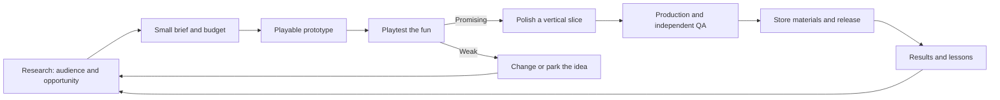

# Game-Studio

A small game studio for Klaus and Codex: discover worthwhile ideas, make the central interaction fun, polish a compact game, and learn from its release. Built for short projects and occasional human input.

## Use it through conversation

Open a task in the **Game-Studio** Codex project at `D:\Game-Studio`. For example:

- **“Research our next game. Give me three strong candidates we could make in a few days.”**
- **“Prototype this idea. Prioritize the feel of the controls and give me something to play.”**
- **“Continue [game name] from its current status.”**
- **“Prepare [game name] for Steam, including the build, trailer plan, and store materials.”**

Codex reads the studio instructions and uses the relevant skills and specialist roles. You do not need to run commands or manage nine separate conversations. Start a fresh task in this project to pick up the new project-scoped skills and agents; roles can also be delegated through the collaboration tools available in the session.

## The working loop



Research considers **rising trends, near-peak opportunities, and established niches**. Timing matters: a quick build still has to fit store onboarding and release lead times. A popular subject needs an original, satisfying playable hook. No next game has been selected by the setup.

| Where | What it contains |
|---|---|
| [Studio charter](studio/CHARTER.md) | Working preferences, scope, quality, and economic assumptions |
| [Workflow](studio/WORKFLOW.md) | What makes each stage complete and how to resume |
| [Team](studio/TEAM.md) | Nine specialist roles, used as needed |
| [Research](research/README.md) | Sources, scoring, evidence rules, and opportunity history |
| [Initial research pilot](research/runs/2026-09-06-studio-pilot/README.md) | Three draft examples that exercise the process |
| [Games](games/README.md) | One subfolder per future game |
| [Tooling](studio/TOOLING.md) | Scaffolding, checks, engine paths, and Steam snapshots |
| [Setup decisions](studio/decisions/001-bmad-adaptation.md) | What we adopted from BMAD and Appdrip, and why |

## Built-in capabilities

Six project skills cover direction, research, prototyping, production, release, and retrospectives. Nine agent definitions cover production management, trends, market analysis, design, engineering, art, audio, playtesting, and release preparation. These are instructions for on-demand workers, not background services.

The Python studio helper creates consistent game folders, validates the workspace, scores opportunities, reports project stages, checks installed tools, and captures dated public Steam price/review evidence. Automated checks run on GitHub for studio changes. They do not claim to test future game builds.

```powershell
python scripts/studio.py status
python scripts/studio.py doctor
python scripts/studio.py validate
python -m unittest discover -s tests -v
```

**Dependencies:** Python 3.11+ and Git. No paid service, API key, full BMAD installation, or new engine is needed for the studio itself. Choose the engine and any graphics/audio tools when a game's needs are known.

BMAD's short briefs, specialist handoffs, prototype loops, and independent review informed the design. Appdrip's research sources, opportunity archive, and resumable handoffs informed the research process. The implementation is original and native to this Codex project. [BMAD adaptation record](studio/decisions/001-bmad-adaptation.md).
