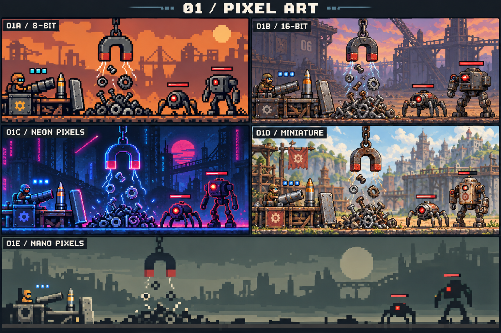
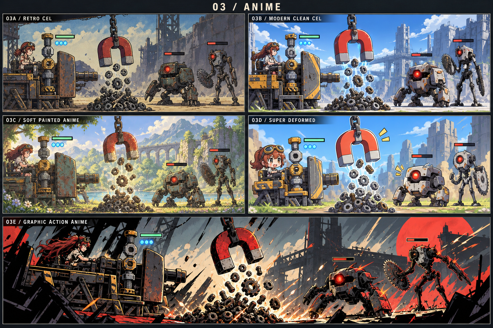
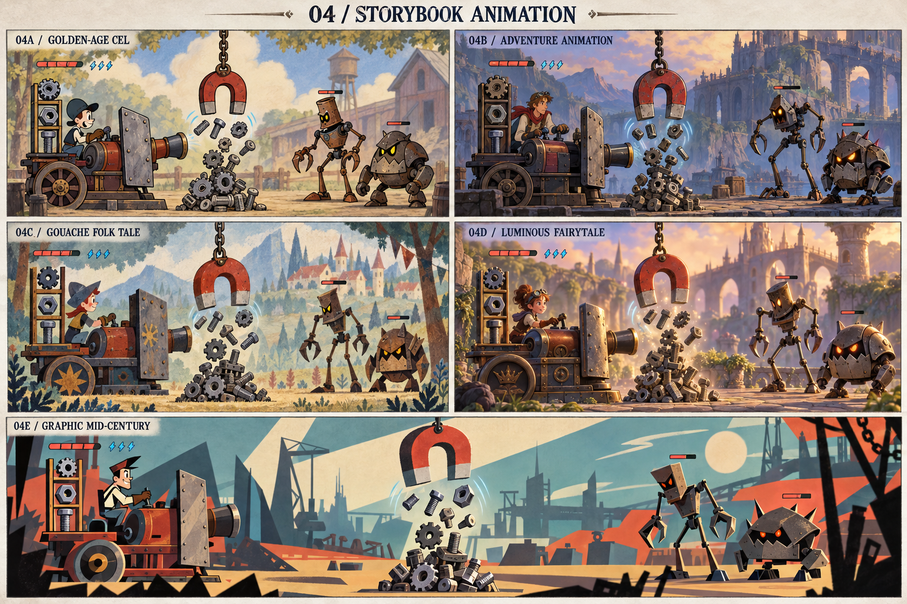
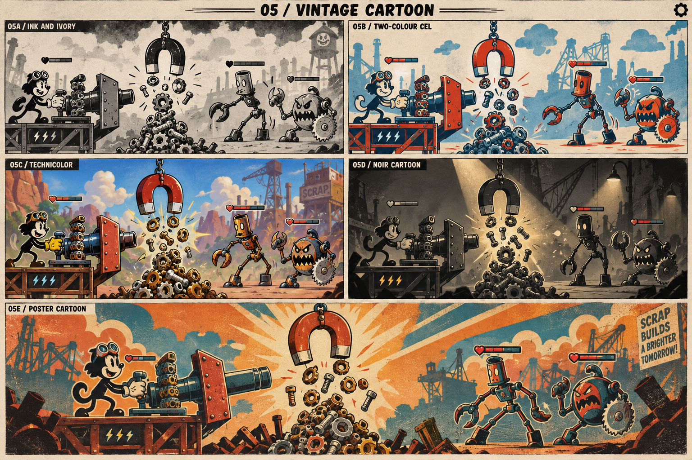
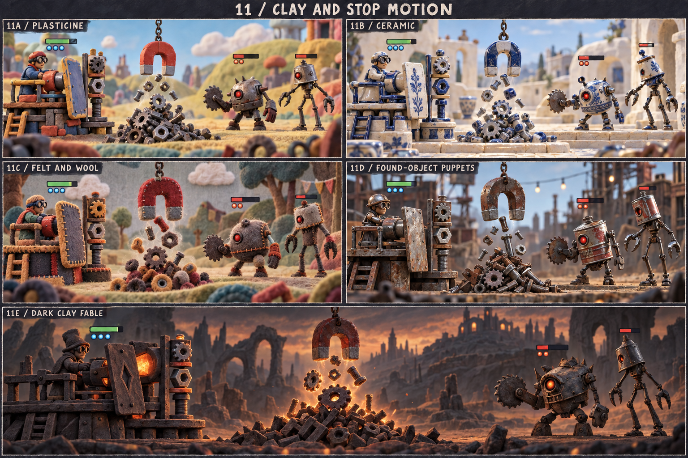
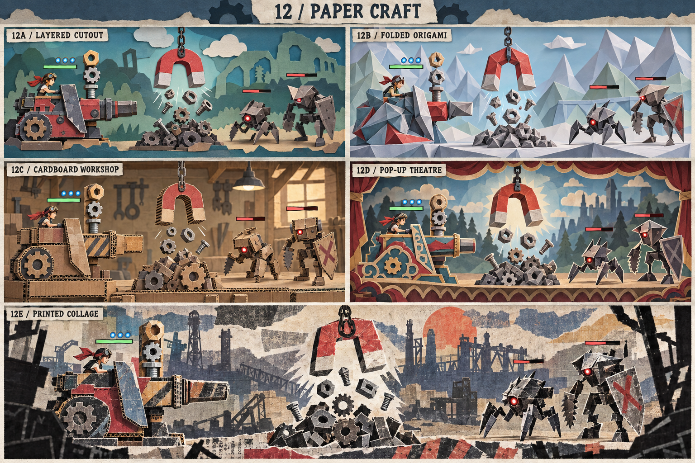
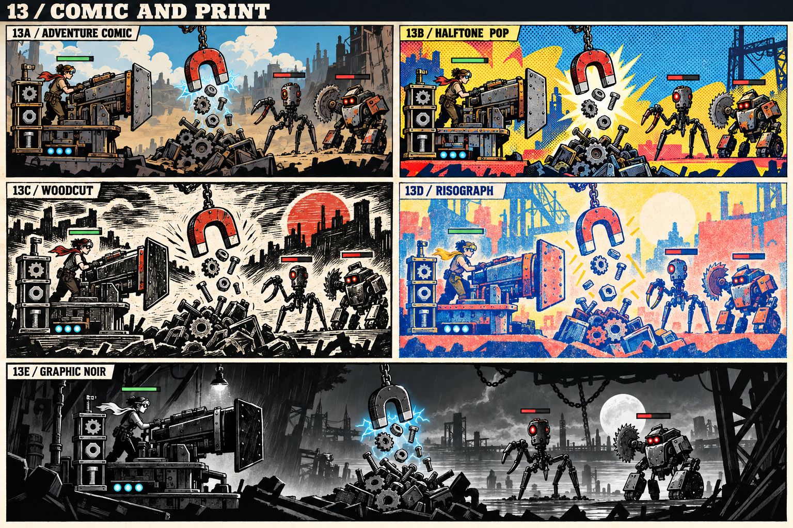
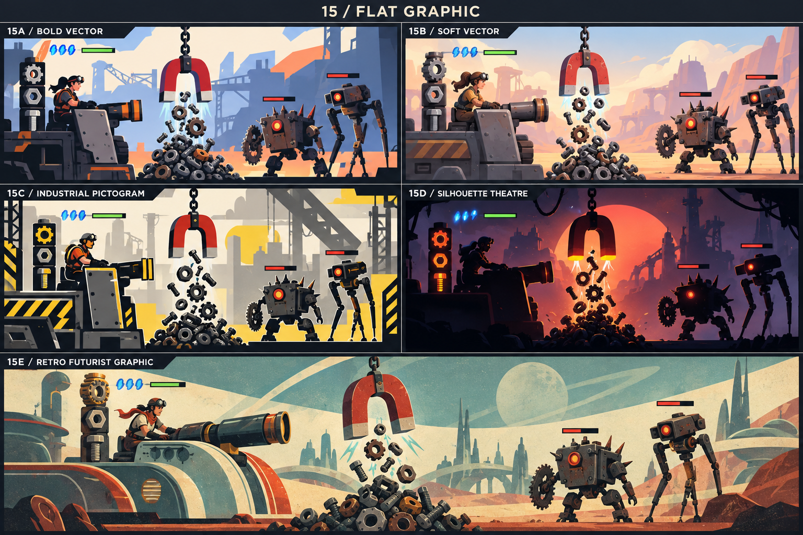
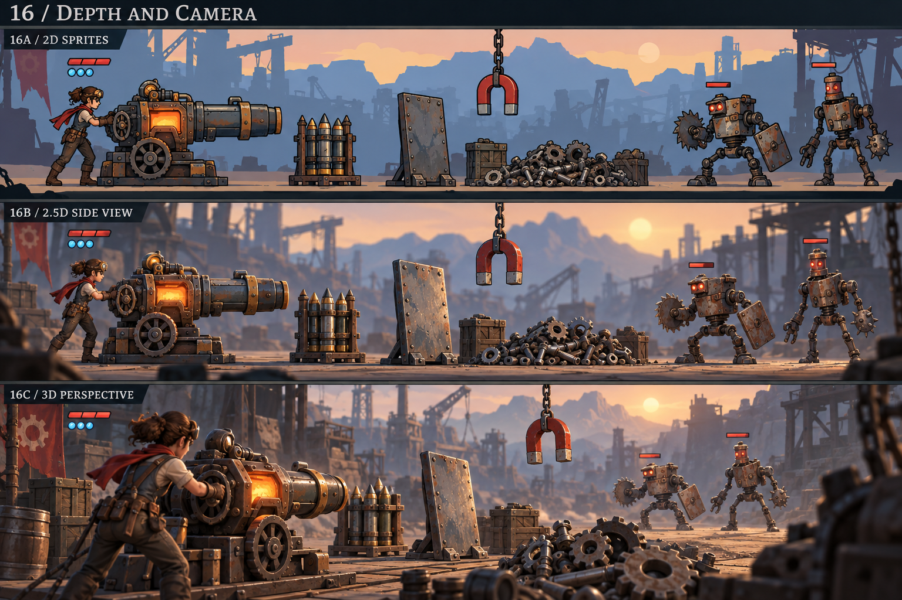

# Magnet Sweep — visual direction atlas

13 September 2026. **Owner prefers 16C as the foundation; refinement and a repeatable production method remain to be proved.** Generated concept boards compare possible identities. They are not screenshots of an implemented redesign. Characters, scenery, colour coding, health values and mechanisms are visual placeholders, not selected fiction or rules.

## Current owner preference

Klaus explicitly reconfirmed board 16 in the continuation task: **16B for preparation/assembly and 16C for action**, with the same graphics treatment. The [four-panel storyboard](../assets/concepts/combat-camera-2026-09-13/storyboard.webp) now refines those moments. [Inspection and provenance](../assets/concepts/combat-camera-2026-09-13/PROVENANCE.md) distinguish its visual strengths from unresolved asset continuity and rule details.

Klaus likes both the graphics treatment and 3D perspective in **16C** for the actual shot. He proposes a separate **2.5D side-view preparation screen** showing enemies, available scrap and a component bar to build the shot. Fire then switches to 3D for discharge and impact; explore the enemy response in 3D as well. See [the camera-flow proposal](COMBAT-CAMERA-FLOW.md). This replaces the earlier request for a broad shortlist. It does not settle damage, targeting, whether Fire ends the turn, final fiction or the exact UI.

## How to review

Open the [local browser preview](http://127.0.0.1:8874/assets/concepts/art-direction-2026-09-13/index.html) to switch boards, enlarge the original artwork and collect favourite codes. The [review page source](../assets/concepts/art-direction-2026-09-13/index.html) and its images are saved together. Its shortlist and notes stay in that browser when storage is available; copy the resulting text into our conversation to communicate a preference. Nothing in the page selects or approves an art direction automatically. The temporary preview can be restarted from the studio root with `python -m http.server 8874 --bind 127.0.0.1 --directory games/magnet-sweep`.

Each archived board has one visual family and five coded variants, A–E. The earlier request for a shortlist is superseded by Klaus's 16B/16C selection. Use this archive for comparison only; continue refining the selected foundation.

The comparison uses the same functional scene: hanging magnet, airborne scrap, a physical loading stack, forge-cannon, protective plate and two enemies. This makes the style differences easier to see. The wide E panel gives more environmental space, so judge object treatment rather than panel size. The board labels are descriptions of appearance; “8-bit” and “16-bit” do not certify historical palette/hardware restrictions. Generated frames occasionally invent decorative details or ambiguous connections; a selected direction must be refined into mechanically correct objects.

## Camera and artwork are separate choices

| Presentation | What it would mean here | Practical strength | Main question to test |
| --- | --- | --- | --- |
| 2D sprites | Flat characters/parts with layered drawn scenery | Direct silhouette control; strong illustrated identity | Can rotated and stacked scrap remain clear without producing many redrawn poses? |
| 2.5D side view | Action stays on a lateral plane; art can combine 3D objects and layered illustration | Visible chain swing, object volume and pile depth while retaining a readable side view | Do depth and shadows help rather than hide selectable pieces? |
| 3D perspective | A spatial camera views a fully modelled encounter | Flexible camera and dimensional impact shots | Do occlusion, depth picking and camera movement add anything useful to this turn-based loop? |

The owner's preferred combination is **16B preparation and 16C action**, using the same graphics treatment throughout. The [first shared-scene motion study](../art-tests/camera-motion/README.md) now demonstrates two authored cameras with consistent geometry and remaining stock. Its simple models and scripted motion do not yet reproduce the reference's finish or establish interactive game feel.

## Boards

**15 style families × five variants = 75 examples**, plus a separate three-panel depth/camera comparison. All 16 boards were generated and inspected. [Exact prompts and image records](art-direction-boards.json).
| Board | Variants A–E (camera board A–C) |
| --- | --- |
| [01 — Pixel Art](../assets/concepts/art-direction-2026-09-13/01-pixel-art.webp) | A: 8-bit · B: 16-bit · C: Neon pixels · D: Miniature · E: Nano pixels |
| [02 — Watercolour](../assets/concepts/art-direction-2026-09-13/02-watercolour.webp) | A: Transparent washes · B: Ink and wash · C: Storm wash · D: Pastel storybook · E: Bold pigment |
| [03 — Anime](../assets/concepts/art-direction-2026-09-13/03-anime.webp) | A: Retro cel · B: Modern clean cel · C: Soft painted anime · D: Super deformed · E: Graphic action anime |
| [04 — Storybook Animation](../assets/concepts/art-direction-2026-09-13/04-storybook-animation.webp) | A: Golden-age cel · B: Adventure animation · C: Gouache folk tale · D: Luminous fairytale · E: Graphic mid-century |
| [05 — Vintage Cartoon](../assets/concepts/art-direction-2026-09-13/05-vintage-cartoon.webp) | A: Ink and ivory · B: Two-colour cel · C: Technicolor · D: Noir cartoon · E: Poster cartoon |
| [06 — Modern Art](../assets/concepts/art-direction-2026-09-13/06-modern-art.webp) | A: Bauhaus machinery · B: Cut-paper colour · C: Geometric surrealism · D: Psychedelic print · E: Minimal colour field |
| [07 — Line Art](../assets/concepts/art-direction-2026-09-13/07-line-art.webp) | A: Ink engraving · B: Clear-line comic · C: Pencil notebook · D: Coloured contour · E: Brush and ink |
| [08 — Playful 3D](../assets/concepts/art-direction-2026-09-13/08-playful-3d.webp) | A: Toy diorama · B: Round and bouncy · C: Adventure cel · D: Crafted miniature · E: Stylised spectacle |
| [09 — Realism](../assets/concepts/art-direction-2026-09-13/09-realism.webp) | A: Working steel · B: Cinematic salvage · C: Clean future · D: Retrofuture · E: Nature reclaimed |
| [10 — Low-Poly 3D](../assets/concepts/art-direction-2026-09-13/10-low-poly.webp) | A: Faceted sculpture · B: Retro console · C: Pastel geometry · D: Neon geometry · E: Painted facets |
| [11 — Clay And Stop Motion](../assets/concepts/art-direction-2026-09-13/11-clay-stop-motion.webp) | A: Plasticine · B: Ceramic · C: Felt and wool · D: Found-object puppets · E: Dark clay fable |
| [12 — Paper Craft](../assets/concepts/art-direction-2026-09-13/12-paper-craft.webp) | A: Layered cutout · B: Folded origami · C: Cardboard workshop · D: Pop-up theatre · E: Printed collage |
| [13 — Comic And Print](../assets/concepts/art-direction-2026-09-13/13-comic-print.webp) | A: Adventure comic · B: Halftone pop · C: Woodcut · D: Risograph · E: Graphic noir |
| [14 — Painterly](../assets/concepts/art-direction-2026-09-13/14-painterly.webp) | A: Oil impasto · B: Gouache adventure · C: Digital brushwork · D: Painted 3D · E: Pastel chalk |
| [15 — Flat Graphic](../assets/concepts/art-direction-2026-09-13/15-flat-vector.webp) | A: Bold vector · B: Soft vector · C: Industrial pictogram · D: Silhouette theatre · E: Retro futurist graphic |
| [16 — Depth And Camera](../assets/concepts/art-direction-2026-09-13/16-depth-camera.webp) | A: 2D sprites · B: 2.5D side view · C: 3D perspective |

**Earlier root shortlist, retained for comparison:** 07B Clear-line comic, 08D Crafted miniature and 14D Painted 3D. The owner subsequently preferred 16C; these alternatives do not override that preference.

### 01 — Pixel Art

All five coded variants present. The very coarse treatment loses individual part identity; 16-bit/miniature variants preserve more detail. Pixel labels describe an aesthetic, not hardware-accurate sprites.

### 02 — Watercolour

All five present. Wash handling and mood differ; ink-and-wash gives useful edge definition. Fine rust detail would need simplifying at smaller gameplay sizes.

### 03 — Anime

All five present. Clear cel and super-deformed forms differ from painted backgrounds. Graphic action panel uses a canted composition, so compare its line/colour treatment rather than adopting that camera.

### 04 — Storybook Animation

All five present, from classic inked animation to volumetric modern rendering. Character/world motifs are placeholders and need original identity development after selection.

### 05 — Vintage Cartoon

All five present. Black silhouettes and exaggerated poses communicate vintage appeal. Noir loses dark foreground detail; board includes decorative scenery text, not approved narrative/UI.

### 06 — Modern Art

All five present. Shape and background language differ substantially. Psychedelic background competes with play; minimal colour-field version separates machinery clearly.

### 07 — Line Art

All five present. Clear-line variant offers clean part edges; engraving/pencil/brush textures can obscure the pile. An outline workflow needs motion testing.

### 08 — Playful 3D

All five present. Rounded toy, cel and crafted-material approaches differ. Miniature surface treatment conveys weight; focus blur should not touch interactable parts.

### 09 — Realism

All five present. Realistic material/lighting alternatives are visible. Dense rust/moss can make parts merge with the pile and raise asset-cleanup demands.

### 10 — Low-Poly 3D

All five present. Large facets, retro texture, soft colour and emissive geometry vary. Retro-console panel has low-resolution smear and must be refined before serving as a production target.

### 11 — Clay And Stop Motion

All five present. Plasticine, ceramic, textile and found-object surfaces differ strongly. Felt/ceramic must preserve the meaning of metal or establish a clear handmade-world convention.

### 12 — Paper Craft

All five present. Cutouts, folds, corrugation, theatre and collage are distinct. Origami makes small gears less recognisable; layered cutout keeps cleaner functional shapes.

### 13 — Comic And Print

All five present. Print texture changes substantially. Halftone and woodcut backgrounds can compete with scrap edges; noir makes the bright magnet lead well.

### 14 — Painterly

All five present. Oil/chalk textures differ from gouache and painted volume. Painted 3D gives a promising path to repeatable shapes; strongly textured alternatives need edge hierarchy.

### 15 — Flat Graphic

All five present. Flat, soft, pictographic, silhouette and retrofuturist approaches differ. Flat treatments still include some volumetric shading; silhouette option hides part materials and needs inspection feedback.

### 16 — Depth And Camera

All three depth/camera variants present, with flat contours, side-view volume and three-quarter perspective. The perspective view demonstrates occlusion. Generated ammunition appears as a rack of completed rounds, so this board is only a camera/depth comparison and must not become the assembly/mechanism specification.

## Repeatable production routes

These are task-specific production assessments, not measured schedules. The owner has removed development timelines as a consideration. “Easier to extend” means fewer one-off redraws, reusable pieces, controllable animation and predictable consistency.

| Family | Credible route using our tools | Where consistency needs proof |
| --- | --- | --- |
| Pixel art | Author a small sprite/tile vocabulary; use fixed pixel sizes and palette rules; optionally render a model as an underdrawing | Clean pixel clusters, rotations and animation need deliberate cleanup; image generation alone is not a production sprite pipeline |
| Watercolour | Layer painted backgrounds; use crisp movable cutouts or brush-textured 3D foreground assets | Prevent soft washes from hiding edges and keep pigment texture stable during motion |
| Anime | Rigged cel-shaded models or separate drawn parts, painted backgrounds and hand-shaped effects | Consistent outlines, facial/pose appeal and shadow thresholds across movement |
| Storybook animation | Painted layers plus rigs or stylised 3D; give main machinery a distinct silhouette | The animated acting and material finish must live up to the still frame |
| Vintage cartoon | Cutout rigs with selectively drawn special poses/effects, or carefully shaded 3D | Authentic elastic motion is a major craft requirement; a vintage filter does not supply it |
| Modern art | Small geometric 2D/3D kit with a strict palette and composition system | Abstract treatment must preserve the meaning of scrap, armour, magnet and enemies |
| Line art | Toon/outline rendering or clean cutout drawings over illustrated layers | Stable line weight, no crawling hatching and strong selectable-object separation |
| Playful 3D | Reusable Blender models, a small material library, expressive rigs and art-directed lighting | Attractive proportions and materials at normal gameplay size |
| Realism | Coherent model kit, consistent physically based materials and controlled lighting | Surface detail and believable engineering can increase authoring/cleanup needs and visual noise |
| Low-poly 3D | Deliberate simple meshes, shared palettes/materials and reusable rigs | Avoid generic asset-pack appearance; preserve recognisable object geometry |
| Clay/stop motion | 3D meshes with tactile materials and restrained stepped animation | Keep handcrafted texture believable in motion; material choice must suit the fiction |
| Paper craft | Layered planes or shallow meshes, illustrated textures and small rigged assemblies | Paper joints, folding and occlusion must stay coherent as pieces stack and rotate |
| Comic/print | Clear silhouettes, toon shading, hand-drawn or procedural print textures | Halftone, grain and cross-hatching must not fight with important gameplay cues |
| Painterly | Brush-textured 3D foreground kit or cutouts with layered painted scenery | Surface strokes should stay attached to forms and remain consistent across lighting |
| Flat graphic | Reusable geometric artwork or flat-shaded models with a tightly controlled visual grammar | Needs excellent composition, motion and material distinctions to avoid the rejected slide-like appearance |

ImageGen is useful for choosing the look and producing candidate source art. Blender is configured locally and its executable was found; it is appropriate for repeatable geometry, materials, rigs and render tests. TRELLIS may help with hero-model candidates after a direction is selected, but generated meshes still need topology, scale, pivots, materials and animation inspection. No live TRELLIS service or new asset pipeline was verified during this breadth pass. Unreal should provide actual readable text, interactions and game-state feedback; text baked into these boards is concept artwork.

## Research that informs the choices

Sources accessed 2026-09-13. These are inspected documentation/interview text, not an assertion that every linked video or game was played.

- [Epic's Paper 2D documentation](https://dev.epicgames.com/documentation/unreal-engine/paper-2d-overview-in-unreal-engine) documents sprites, sprite sheets, flipbooks and tile systems for 2D and hybrid projects. This establishes a supported route within the available engine, not proof of this game's complete pipeline.
- [Octopath Traveler II developer interview, 22 August 2023](https://www.unrealengine.com/developer-interviews/octopath-traveler-ii-builds-a-bigger-bolder-world-in-its-stunning-hd-2d-style?lang=en-US) discusses pixel artwork in 3D surroundings, altered proportions and lighting. It supports separating medium from scene depth. Its embedded videos were not watched.
- [Studio MDHR's official press kit](https://studiomdhr.com/press-kits/) identifies Cuphead's traditional cel animation and watercolour backgrounds. The cited inspiration is the 1930s, adjacent to the owner's 1940s interest. Our vintage board explores a broader period and does not copy its cast or UI.
- [Dordogne developer interview, 6 March 2023](https://www.cnc.fr/web/en/news/dordogne-the-story-behind-a-watercolour-video-game_1905450) describes watercolour on paper combined with 3D/parallax. The artist's expertise made that method practical for that team; it does not establish that hand-painting is automatically easiest for us.
- A Nintendo Paper Mario developer-interview search result discussed papercraft, but the direct page timed out. Blender's Grease Pencil pages also failed to load through the web tool. Neither is used as evidence of a verified runtime/export workflow here.

Our visual comparison is generated original subject matter, not a collage of other games' assets. The referenced games inform techniques; their market performance has not been used to predict sales for these styles.

## What establishes the final choice

1. **Preference received:** Klaus chose 16C as the visual foundation and proposed the preparation/action camera split. Keep this distinct from approval of a finished style guide or all pictured objects.
2. Refine the preferred identity across a quiet scene, magnet pull, loading/fire sequence and enemy impact. Establish recognisable scrap/material shapes and a restrained real UI treatment.
3. Make a small reproducibility test: the same magnet from several angles, several consistent scrap types, one enemy and a short motion/render sample using the proposed asset route. It can be a separate art test; it need not implement the game.
4. Record the accepted shape language, palette, materials, line/texture rules, lighting, UI relationship and asset method. Only call the direction selected when the owner accepts it and the extension method has evidence.

The current goal remains active. These boards are a broad first pass, not a claim to cover every possible art style or to have established owner satisfaction.
