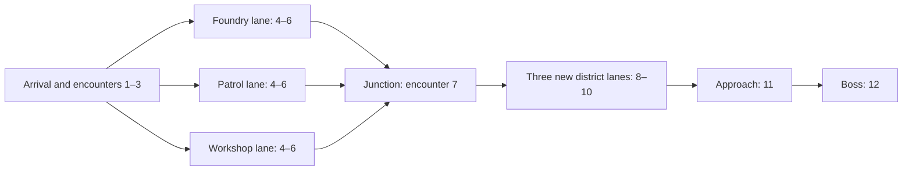
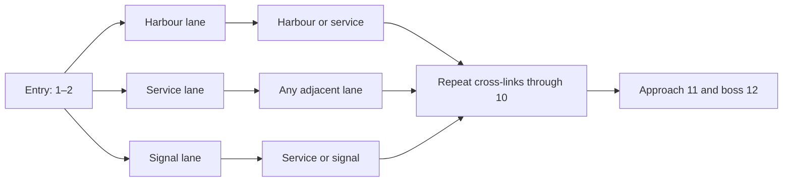
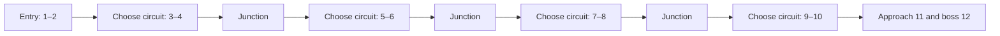
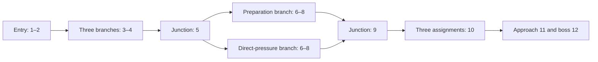

# Overkill Foundry — gated procedural campaigns

**20 September beta fixture:** [BETA-TUNING.md](BETA-TUNING.md) now adopts twelve encounters per city, the existing gates/registries, 80 starting HP for every mercenary and ten-material hauls, and supplies exact offer/core/shop numbers and 40/30/30 Mystery category weights. These are initial test values, not measured survivability. Individual Mystery outcomes and the runtime manifest still need implementation. The owner now selects single Rivet Mites with stronger companions and accepts a lone survivor for beta; overtime is not selected.

**16 September 2026 · design proposal, not a tested balance curve**

Generate robot attacks from progressively unlocked pools. **Mercenary → city → progress band → district → compatible formation → legal attack pattern.** Early attacks draw from a small pool of lesser robots; later attacks unlock tougher bodies, support combinations and more complex behaviours. Randomness selects inside these gates; it does not decide whether an opening fight should be endgame difficulty.

Klaus requires **four different mercenary progression trees, each visiting three different cities: twelve city identities in total**. Gated procedural attacks, three-city campaigns, ordinary three-offer choices and a Regular alternative are owner requirements. The city names, route shapes, twelve-encounter fixture and specific placements below are proposed ways to fulfil them. The earlier three city names now belong to Mara's proposed campaign, rather than all characters sharing them.

## What the research contributes

Two agents examined STS2 progression and our starter/robot fit. The source uses easier pools for the first three Regular fights in Act 1 and first two in later acts, delays elites, and varies enemy patterns through fixed openers, constrained random moves and state-dependent branches. Its substantial recovery options differ from our HP carryover. We borrow graduated pressure, readable choices and bounded variation; exact source floor counts, healing and probabilities do not transfer. Sources: [STS2 Monsters](https://slaythespire.wiki.gg/wiki/Slay_the_Spire_2:Monsters), [Rest Sites](https://slaythespire.wiki.gg/wiki/Slay_the_Spire_2:Rest_Sites), [Hunter Killer](https://slaythespire.wiki.gg/wiki/Slay_the_Spire_2:Hunter_Killer).

See the dated [progression evidence](research/2026-09-16-sts2-progression.md) and [mercenary fit study](research/2026-09-16-mercenary-route-fit.md). Direct wiki access failed; research used indexed individual-page extracts, which can lag the live game. No current game executable or complete source map-generation algorithm was inspected. Character-exclusive cities are our design, not a claimed STS2 feature.

## One pacing framework

Use **12 completed encounters per city for the first beta fixture: 11 ordinary choices and one final boss**. This sits inside the selected 10–20 range; it does not replace that range with a permanently fixed length. All branches have the same number of encounters. A Mayor visit, junction, shop revisit or boss-preparation screen adds no encounter. A completed Mystery counts once, whether combat, merchant or tech.

| Position in city | Gate | Eligible content and purpose |
| --- | --- | --- |
| Arrival, before encounter 1 | Mayor | Choose one of three Rare/Legendary permanent upgrades. Reveal this city's boss identity and its key threat. No automatic heal. |
| 1–3 in City 1; 1–2 in Cities 2–3 | Introduction | Three Regular offers from the city's opening pool. No Officer or Mystery yet. Show new threats in simple formations. |
| After introduction through 6 | Development | Keep opening formations; add the middle pool. Introduce one unfamiliar pressure at a time. Officers can first be offered at position 4. |
| 7–10 | Pressure | Add the late pool and compatible combinations. Retain a simpler Regular alternative. Complex Officers are optional. |
| 11 | Approach | Three ordinary offers using opening/middle formations; no Officer. Review rewards and existing shop stock before the boss. This conserves pressure but grants no free healing, parts or restock. |
| 12 | Boss | One previously revealed boss replaces the ordinary three offers. City victory advances the campaign or ends it after City 3. |

The initial Regular-only window means the first three/two completed encounters really are Regular fights. Later noncombat Mysteries never count as extra teaching fights. Maintain both counters when evaluating what the player has encountered. A formation combining mechanics the player has skipped needs a simpler first-exposure alternative; an encounter number alone is not evidence that a lesson was learned.

**Officer/Mystery frequency proposal:** choose three non-adjacent Officer opportunity positions from 4–10, and three Mystery positions after introduction through 11. Each therefore appears in 3 of 11 ordinary offer sets, about 27%, close to the selected approximately-quarter preference. They may overlap. This is offer-set presence, not 27% of cards or compulsory fights. Legal sets include R/R/R, R/R/O, R/R/M and R/O/M. The player can choose Regular at every ordinary step.

Each Officer opportunity uses a different identity from that city's three-entry Officer pool. Rotate their order by seed, with the preferred first Officer in the registry as the initial fixture and tier-3 Citadel Breacher gated to position 8 or later. There is no repeat within these three opportunities. All branches at the same position share its offer-category schedule, so changing lanes cannot farm additional Officer offers. Mystery outcome weights remain separate, unselected work; a Mystery combat draws from the current Regular gate, never conceals an Officer or boss. Existing event costs and refusal rules still apply.

## Four progression trees

These graphs show **district access**, not a replacement for three encounter offers. Choosing an encounter at a fork also chooses its district. Within a committed district, the next ordinary step still offers three encounters. A junction is a transition with no free reward, heal, Bolt repair, Charge or resource grant.

Before committing, show the upcoming district's encounter range, eligible robot roles, known Officer opportunities and boss. Seeds change district order, eligible formations and legal route variants. They do not move the boss earlier or add encounters to a branch.

### Mara — long forks

**Cinderwall → Coilbridge → Glassward.** Two stretches of commitment reward preparing for a known family of threats. Each city uses its own district names and pools.

At each three-lane fork, one offer leads to each lane. After choosing, stay in that lane for the marked stretch. Lane labels describe tendencies, not exclusive damage requirements: at least one accessible Regular avoids the district's most restrictive mechanic.

### Ivo — braided routes

**Brinegate → Sablecross → Veilcourt.** Encounters 1–2 share an entry corridor. At 3–10, three district lanes have cross-links at every step: stay or move to an adjacent lane. At an outer lane, three offers are distributed across the two reachable lanes; at the middle lane all three are reachable. Encounters 11–12 converge.

The player can change exposure more frequently than Mara. Swapping lanes does not reroll a node or guarantee an Acid Etch advantage. One safe Regular offer is always reachable even at the outer lanes.

### Ada — short district circuits

**Rivetford → Latchhaven → Relaykeep.** Encounters 1–2 share an introduction. Choose a two-encounter circuit at 3–4, another at 5–6, another at 7–8 and another at 9–10. Each return opens a fresh choice of three circuits; all visits are new encounters.

This gives Ada repeated chances to change between split-target, defence and support-removal assignments. Returning to a junction neither revives Bolt nor reopens completed rewards. A circuit cannot be repeated for farming.

### Noor — alternating wide and narrow branches

**Copperwake → Stormrail → Prismhold.** Encounters 1–2 form the entry. Choose one of three short branches at 3–4, converge at 5, then choose one of two longer branches for 6–8, converge at 9, choose one of three assignments at 10 and converge at 11–12.

At the two-way fork, three offers are split between the two branches; neither branch is exclusively Officers. Seeded variants may swap the narrow/wide sections while preserving their lengths and the common pacing gates. Planning windows support Charge choices without giving free Charge or assuming cooling can refresh a no-cooldown recipe.

The graphs use the same step numbers in all three cities of a mercenary campaign, while city-specific district placement and enemy pools change. City 1's introduction gate also applies to position 3 even if its graph has already forked. These are four genuinely different access patterns, with reused readable conventions within each campaign.

## City registry and robot placement

The [42-entry robot library](ENEMY-ROSTER.md) remains the mechanical source. **C1/C2/C3 now identify campaign-stage threat tiers, not twelve physical city IDs.** Do not multiply the roster into 168 robots or randomly increase an existing robot's stats to make a new city. Local chassis decoration and surrounding districts can give shared robot families a coherent city identity.

Each opening pool has three formation templates. Middle adds the listed templates; late adds its listed templates while earlier options remain eligible. `+` means the explicitly paired formation. Commas separate alternatives, never a squad containing everything in that cell. An existing multi-body entry, such as Siphon Pair, is already one complete formation. Every boss is a separate alternative, not an extra fight.

| Mercenary / city | Opening pool | Add in middle | Add in late | Preferred first Officer; initial boss |
| --- | --- | --- | --- | --- |
| **Mara 1: Cinderwall** — furnaces and scrap yards | One Rivet Mite C1-R01 + Breach Ram R02; solo Breach Ram R02; solo Pressure Cask R05 | Knuckle Press R08; Cable Binder R04 | Coil Nest R07 | C1-O01 Redline Pursuer; C1-B01 Gatebreaker Prime |
| **Mara 2: Coilbridge** — bridges and foundry freight | Solo Cargo Ram C2-R01; Latch Harvester R05; Magpie Courier R08 | Screen Loader R02 + Cargo Ram; Brood Press R07 | Signal Loom R04 + Cargo Ram; Booster Cart R03 + Cargo Ram | C2-O01 Coupled Hauler; C2-B01 Twin Gantry |
| **Mara 3: Glassward** — surveillance avenues | Solo Litany Engine C3-R01; Vault Ram R05; Surveyor Crown R07 | Aegis Tug R02 + Beltgun Porter R03 | Municipal Assembly Rig R04; Siphon Pair R08 | C3-O03 Grid Conductor; C3-B02 Continuity Engine |
| **Ivo 1: Brinegate** — salt-worn harbour | One Rivet Mite C1-R01 + Breach Ram R02; solo Breach Ram R02; Pressure Cask R05 | Knuckle Press R08; Coil Nest R07 | Coil Sentinel R03; Narrowband Emitter R06 + one 6-HP mite | C1-O03 Split Chassis; C1-B02 Standby Leviathan |
| **Ivo 2: Sablecross** — culverts and night freight | Solo Latch Harvester C2-R05; Cargo Ram R01; Magpie Courier R08 | Screen Loader R02 + Cargo Ram; Feedback Pylon R06 | Brood Press R07; Signal Loom R04 + Cargo Ram | C2-O02 Backscatter Rig; C2-B02 Audit Engine |
| **Ivo 3: Veilcourt** — sensor estates and vaults | Solo Vault Ram C3-R05; Surveyor Crown R07; Litany Engine R01 | Aegis Tug R02 + Beltgun Porter R03 | Siphon Pair R08; Municipal Assembly Rig R04 | C3-O03 Grid Conductor; C3-B01 Civic Command Core and Bailiff |
| **Ada 1: Rivetford** — residential repair works | One Rivet Mite C1-R01 + Breach Ram R02; solo Pressure Cask R05; Breach Ram R02 | Coil Nest R07; Cable Binder R04 | Knuckle Press R08; Cable Binder + one 6-HP mite | C1-O02 Foil Warden; C1-B03 Fuse Cathedral |
| **Ada 2: Latchhaven** — modular transit depots | Solo Magpie Courier C2-R08; Latch Harvester R05; Cargo Ram R01 | Brood Press R07; Booster Cart R03 + Cargo Ram | Screen Loader R02 + Cargo Ram; Signal Loom R04 + Cargo Ram | C2-O01 Coupled Hauler; C2-B03 Conveyor Sovereign |
| **Ada 3: Relaykeep** — civic emergency networks | Solo Litany Engine C3-R01; Vault Ram R05; Surveyor Crown R07 | Municipal Assembly Rig R04 | Aegis Tug R02 + Beltgun Porter R03; Siphon Pair R08 | C3-O01 Compliance Triad; C3-B01 Civic Command Core and Bailiff |
| **Noor 1: Copperwake** — tidal power works | One Rivet Mite C1-R01 + Breach Ram R02; solo Breach Ram R02; Pressure Cask R05 | Coil Nest R07; Knuckle Press R08 | Cable Binder R04; Coil Sentinel R03 | C1-O03 Split Chassis; C1-B02 Standby Leviathan |
| **Noor 2: Stormrail** — electrified viaducts | Solo Cargo Ram C2-R01; Magpie Courier R08; Latch Harvester R05 | Brood Press R07; Screen Loader R02 + Cargo Ram | Booster Cart R03 + Cargo Ram; Signal Loom R04 + Cargo Ram | C2-O01 Coupled Hauler; C2-B03 Conveyor Sovereign |
| **Noor 3: Prismhold** — optical towers and substations | Solo Vault Ram C3-R05; Litany Engine R01; Surveyor Crown R07 | Municipal Assembly Rig R04 | Aegis Tug R02 + Beltgun Porter R03; Induction Auditor R06, explicitly optional beside a simpler Regular | C3-O03 Grid Conductor; C3-B02 Continuity Engine |

The revised teaching formation uses one 7-HP Rivet Mite and one 24-HP Breach Ram. The owner's 20 September placement decision replaces the earlier two-Mite fixtures: no Mite-only opening and at most one live Rivet Mite, also for summons/death-spawns. A Mite left alone after its stronger companion dies is accepted for beta and does not trigger overtime. The three distinct City 1 opening offers remain available through the mixed formation, solo Ram and solo Pressure Cask. These are not random HP rolls. Later-city opening robots are lesser than their own city's combinations, not weaker than City 1 enemies. Their printed HP/damage remain provisional until tested against actual city-entry builds.

All cities use their tier's three Officers, subject to the timing and counterplay restrictions. For initial costed studies, use the named boss above. Later seeded boss alternatives may use the other bosses from that tier after each has a viable Regular-route build test; reveal the selected boss at arrival. In particular, Noor's Chronometric Governor alternative requires a demonstrated answer from a cooling/multiple-shot build before activation. No counter is justified merely because another rare build could defeat it.

**District weighting proposal:** one lane favours solitary chassis, another groups/support, another preparation/status pressure. Apply a 2:1 sampling weight to eligible favoured formations, not hidden extra HP. A lane must have at least three eligible offers or borrow simpler templates from its city's opening pool. Restricted late mechanics cannot fill all three cards. This preserves route identity without requiring a particular rare recipe, one Mayor choice, or a single damage strategy.

## What a generated attack contains

A generated attack is a saved encounter record: city, position, district, category, formation template, robot bodies/positions, permitted pattern variants, reward allocation and encounter seed. It is generated from authored constraints, not by independently rolling every robot on the full roster.

1. Filter by mercenary, city tier and progress band.
2. Filter for district fit, formation compatibility and first-exposure rules.
3. Include at least one simpler Regular candidate that avoids the other offers' strongest restriction.
4. Select distinct formations, favouring those not recently completed. Exclude the immediately previous formation only when enough other eligible formations remain to fill every required Regular slot. Otherwise it can reappear as an offer; never reduce the three choices or invent a stronger opening enemy to satisfy a repetition rule. Reusing a robot in a different squad is allowed.
5. Assign legal opening patterns and check combined pressure before showing the offer.
6. Save the offer set. Reopening it, shopping or rearranging recipes does not reroll it.

Use authored formation templates for the first beta. Procedural assembly may choose declared interchangeable slots later, but only within each template's validated limits. For example, swapping a support robot does not also grant permission to add another attacker, Armor aura and recoil. **A formation's strength is not just the sum of its robots' HP.** Record simultaneous attack damage, hit count, defence, scaling, summoning and interference separately.

| Gate | Initial composition restrictions |
| --- | --- |
| Introduction | Solo chassis or the explicitly listed one-Mite/Breach-Ram teaching group. No other added supports, recoil, suppression auras or random affixes. Fixed safe opening pattern. |
| Development | One introduced tactical pressure in a template; support pair permitted only when its combined opening is costed. No arbitrary extra body beside a summoner. |
| Pressure | Combine at most two taught pressures; use listed complete formations. No generated pair of summoners, permanent recoil plus suppression, or synchronised charged blasts. |
| Officer | Its authored formation and complete forecast; no randomly attached Regular escorts. |
| Boss | Its authored bodies and phases; no external random support pack. Summons follow the boss's own finite rules. |

These are conservative content limits, not a proven numerical threat score. If an intended formation fails the costed build test, remove or move it; do not conceal it behind an average difficulty label. Lower HP may affect the player's choice, not secretly cause the generator to invent a counter or grant a rescue.

## Mayors, rewards and campaign persistence

Every city has its own proposed Mayor identity in [MAYORS.md](MAYORS.md). The owner's 18 September commission expands the earlier nine-example study into a full [upgrade catalogue](UPGRADE-CATALOGUE.md), with distinct Mayor pools for the three city waves, shared choices and mercenary-specific technology. Ancient relics supply the Mayor inspiration; later-wave gifts must be stronger. Each visit still offers three eligible Rare/Legendary upgrades and grants one campaign-permanent choice. The new pools are authored proposals, not tested numerical balance.

The Regular route must be sufficient to develop a viable boss answer. Officers offer extra power for extra risk, not mandatory upgrades disguised as optional encounters. Rewards retain the selected core/recipe/Officer-upgrade rules. A formation receives one encounter recipe offer; adding summons cannot create unlimited rewards. Ordinary shops remain available in and between fights, with their existing restock triggers. Neither a map junction nor a noncombat Mystery silently adds a fight restock.

Completing one city with Mara unlocks Ivo; a city with Ivo unlocks Ada; a city with Ada unlocks Noor. The current campaign continues with its selected mercenary. A later unlocked mercenary's opening city is not automatically harder because of its unlock order.

## Seeded attacks and replay

New campaign seeds choose different eligible formations, district arrangements, Officer/Mystery positions and supported move variants. The shared bands keep progression comparable. [ENEMY-PATTERNS.md](ENEMY-PATTERNS.md) specifies constrained behaviour and immutable revealed intents.

Continue restores the original fight-entry state and seed. The same decisions reproduce the same outcomes. Different decisions may legitimately change a state-dependent pattern, such as whether a summoner has a free slot. Seed streams for routing, formations, enemy moves and rewards must be separate; taking an extra shot cannot consume a route roll. Save the generator/content version and resolved encounter record so an update cannot silently reconstruct a different fight.

## Balance evidence and next concrete study

The [schedule study](analysis/campaign_progression.py) checks the twelve-city registry, legal tier gates, offer quotas, guaranteed Regular alternatives, four district graphs and repeatable schedules across seeds. **Observed result, 16 September:** `python games/overkill-foundry/design/analysis/campaign_progression.py --seeds 1000` passed 12,000 city schedules and 303,000 reachable offer states, plus the Cable Binder packet checks. It does **not** simulate combat, establish survivability, validate every teaching-history branch, price recipes or measure fun. District weighting, anti-repeat history, alternate graph variants, saves and UI are also outside this small study.

Before implementing the generator, cost one complete 12-encounter Regular route and one Officer-taking route per mercenary, starting with City 1. Track actual ingredients, cooldowns, part/Shield timing, rewards and HP carried across every fight. Then test city-entry builds for Cities 2 and 3, including the least favourable legal pattern. Do not assume free recovery or a randomly offered healing recipe. Player starting HP and the ten-material haul remain unresolved/provisional inputs; no honest win-rate or acceptable damage curve can be claimed until those fixtures are explicit.

Starter-specific safeguards, updated to the completed owner review: Mara's immediate Heat bonuses from Shield parts arrive once at first installation; Ivo cannot carry crafted parts between fights; qualifying Bolt support hits return Reactive Mesh damage to Ada under the settled Shield/recoil rule; Noor's cooling cannot refresh no-cooldown recipes. Preserve Hot Barrel and Charged Barrel as explicit character exceptions and include their actual contributions in balance studies. Immediate-Utility Shield grants use the reconciled ordinary removable-part rules. The [timing/save contract](TIMING-AND-PERSISTENCE.md) owns their shared execution order. All 606 recipe rows remain unchanged. The worked encounter is revised only as required by the single-Mite placement decision; its resource and Shield arithmetic remains explicit.

## Post-campaign extension — 18 September proposal

[Lockdown](ENDGAME-PROGRESSION.md) preserves these four three-city graphs and their enemy gates while adding ten cumulative difficulty tiers. The working all-four base-route entry gate is an interpretation awaiting optional clarification; tier advancement thereafter is independent per mercenary. The data row is selected at new-campaign creation and persists with the seed/rules version. Apply supply, HP and enemy modifiers once at their defined boundaries; do not replace route gates with unrestricted high-tier enemy sampling.

After all four Tier 5 clearances, the proposed Command Core opens as an optional epilogue following a qualifying City 3 victory. Commit the normal route/tier victory first. Entering carries the surviving build under normal fight-end clearing and explicit retention exceptions, with no fourth Mayor or automatic heal. Defeat ends that run while preserving the clearance already earned. The [achievement roster](ACHIEVEMENTS.md) records route, city, tier and finale outcomes separately. Counts, penalties, final-boss mechanics and the unlock threshold remain proposals pending encounter and player evidence.
