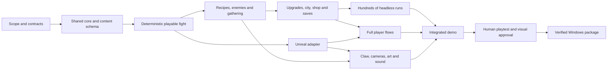

# MVP readiness and implementation order

Review date: 20 September 2026. **Mara's complete first city is now the owner-confirmed MVP scope, with implementation authorized as a goal-driven task.** Source baseline for the earlier readiness review was `1e78ddd`; later decisions below supersede its pending scope/authorization wording. This plan orders implementation without shrinking the full game. Current progress remains in [STATUS](../STATUS.md).

## Readiness verdict

**Ready to implement the confirmed MVP: Mara's complete first city.** The original 111 recipe clarifications are closed. Timing/persistence, [initial beta tuning](BETA-TUNING.md), victory rewards and the F.I.S.T. visual benchmark are specified. The progression/content framework and draft rosters already exist. Deriving the city manifest, authoring its Mystery outcomes and implementing/testing the content are development work. Single-Mite placement is selected; residual lone-survivor farming is an accepted beta test concern and overtime is not selected. Authorization is not evidence of a build or tested balance.

| Finding | Why it matters | Treatment before dependent work |
| --- | --- | --- |
| Resolved: first-MVP scope and build authorization | Owner confirms Mara's complete first city and requests a new goal-driven implementation task | Build the complete Cinderwall route and its supported content, graphical and headless clients, validation and Windows package under the acceptance criteria below. Do not ask for the same scope/implementation permission again. |
| Resolved: Shield protects during Fire | Owner clarifies that firing automatically activates Shield when installed parts provide strength | Ordinary recoil depletes that available Shield before HP. No manual activation, refill or repeated first-installation effect; zero-shot enemy-phase protection and explicit exceptions remain. This is no longer a readiness gap. |
| Resolved at design level: effect order | [Timing contract](TIMING-AND-PERSISTENCE.md) fixes action/reaction order, stable ties, end-phase effects and delayed deliveries | Implement the shared queue and verify its worked traces before enabling complex effects. Preserve explicit clocks and special abilities. |
| Resolved at design level: transitions and persistence | [Save contract](TIMING-AND-PERSISTENCE.md#5-fight-completion-and-between-fight-flow) fixes pre-start rollback, old-stock clearing, staged supplies and once-only choices/results | Implement atomic commits and crash/reload checks; no runtime correctness is claimed by the written contract. |
| Existing content framework; implementation still required | The campaign registry already assigns opening/middle/late robot formations, Officers and bosses across twelve cities. Recipe starters/shared-character rarity pools and filtered upgrade/Mayor pools already exist | Derive the build manifest from those sources for the chosen demo boundary and implement its effects. Individual Mystery outcomes still need authoring; initial offer weights and numerical inputs now come from beta-balance-v1. |
| Whole-city economy and HP attrition have not been simulated | Paper recipe costs and one worked fight do not establish shop affordability, healing supply, repeated generator sales or a beatable boss | Configurable beta values plus complete-city runs and human tests. This is balance work, not a reason to reopen the base rules. |
| No fresh Unreal project or playable proof exists | Concept boards and the old camera study establish a direction, not input quality, runtime performance or graphics approval | Verify the new toolchain, build the shared core, then an actual interactive build. Human visual approval remains a delivery gate. |

The owner resolved recoil protection, the Mite/overtime discussion, the first-MVP scope and implementation authorization on 20 September. Remaining rows describe implementation and validation work. They do not require a new questionnaire before each step. Report genuine blockers promptly with the decision or external action needed; continue useful independent work while awaiting the answer.

## Content framework already available

The [campaign progression plan](CAMPAIGN-PROGRESSION.md) already provides mercenary → city → progress band → district → formation → legal pattern gates and a twelve-city placement registry. The beta fixture uses easier opening Regular fights, then development/pressure pools, optional Officer/Mystery opportunities, an approach fight and one boss. The twelve-encounter count, opportunity schedule and exact placements remain draft tuning within the owner's selected framework.

For example, Mara's Cinderwall opening pool is one Mite with a Breach Ram, solo Breach Ram and solo Pressure Cask; middle/late gates add named formations, with Redline Pursuer as the preferred first Officer and Gatebreaker Prime as the initial boss. That is already a concrete content allocation. The existing 606-recipe catalogue supplies accepted starter sets and shared/character rarity pools; the 288-upgrade catalogue and Mayor rules supply eligibility and tiered offers. No new permanent recipe-unlock gate or replacement roster is needed.

What remains is implementing the relevant effects/data, writing individual Mystery outcomes and testing the now-specified beta values across whole cities. An incomplete runtime does not mean the design framework is missing.

## Confirmed playable boundary

The owner-confirmed first MVP is **Mara's complete first city, Cinderwall**: profile/New Game, Mayor choice, gathering and Precision, crafting and removable parts, repeated shots and End Turn, gated encounter choices, rewards and recipe exchange, shops, Mystery visits, boss victory, death and same-seed Continue. Use Mara's existing city identity and route, with the twelve-encounter initial beta fixture from beta-balance-v1.1. That count remains tunable through actual play, not a reason to request the scope again.

Build configuration starts from the existing 12-recipe starter set, city-specific formation registry, shared/mercenary recipe rarity pools and upgrade/Mayor eligibility rules. Compile the relevant existing IDs into the chosen demo boundary, covering route rewards, shops, Officers, the boss and complete Mystery outcomes. A supported-content manifest is an implementation deliverable, not a request to redesign the pools or select another arbitrary “30 recipes” limit. Verify that the resulting rewards support at least two plausible builds. Include at least one healing path, one cooling interaction, saved-part play, Heat/Hot Barrel, a delayed Shield grant and a deliberate upgrade exception so the MVP tests the actual game.

The old three-fight/roughly-30-recipe proposal is not this MVP. Small fights and temporary assets are development increments; they do not satisfy the complete-city or visual acceptance requirements. Do not silently reduce the selected eligible pool to an arbitrary small recipe/upgrade count. Stage unsupported content during implementation, but every offer reachable in the final enabled manifest must work before delivery.

The full design remains four mercenaries with their own three cities and progression trees, the complete eligible recipe and upgrade pools, later difficulty tiers, the ultimate challenge and Steam achievements. A smaller first build is an integration milestone, not deletion of those commitments. No calendar or owner-time cap is imposed.

## Goal execution and definition of done

The owner authorizes a new goal-driven task to carry P00–P18 through implementation, fixes, tests, visual refinement and a reviewable Windows demo. Earlier step-by-step planning statements asking for separate permission before engine creation are superseded for this selected scope. Begin with the existing source contracts and toolchain check; do not stop after a scaffold, headless fight, paper plan or attractive render.

The goal is complete only when all of these have actual evidence:

- A fresh Windows/Unreal implementation plays Mara's entire first city from New Game and Mayor choice through the gated route, shops, authored Mystery outcomes, Officers and boss to a clear city-completion screen. Defeat and replay/Continue paths work. Later-city entry and other mercenaries can show their MVP unavailability without pretending the whole game is implemented; preserve the earned profile unlock facts.
- Every reward, recipe, generated part, upgrade, robot action/status and nested output reachable in the selected city manifest works according to the settled rules and explicit exceptions. No descriptive-but-nonfunctional offers. Demonstrate at least two viable build approaches in actual play/simulation; no claim of exhaustive combination coverage.
- The graphical game and graphics-free runner execute one authoritative rules core. Use the 22 timing/save traces as the source of expected behavior: implement every case applicable to this MVP and explicitly record cases deferred solely because their character/later-city content is outside scope. Reproduce the revised Mite/Ram fixture, test high-risk interactions, then run hundreds of reproducible complete-city attempts across multiple policies and seeds. Report wins/losses, HP/resource/economy curves, build choices, stalls and reproducible failures. Tune the initial values from evidence without silently redesigning settled rules.
- A representative in-engine encounter establishes the selected F.I.S.T. quality bar early, then every enabled enemy/scene meets the visual contract. Distinct enemy identities/actions, relative-strength hit reactions, spectacular deaths and complete fade/cleanup work with the chosen cameras, UI and sound. Human playtests and Klaus's explicit visual approval are required; automation and screenshots do not supply that approval.
- Saves, same-seed unfinished-fight restart, reward claims/abandonment, shops, progression and recovery are tested. A standalone Windows package launches independently and passes relevant focus/input, resolution/UI, performance and save checks. No known critical crash, progression, data-loss or reward-duplication defect remains; minor limits are documented.
- BUILD.md and QA.md contain the actual commands, build identity, artifact path, checks and observed results. Assets have provenance/rights records. STATUS and game.json reflect real progress, and reviewed source/handoff changes are committed and integrated into the saved project while preserving concurrent work. No public release or Steam publication is required for this MVP.

Raise a genuine blocker as soon as it prevents a required outcome: explain the evidence, what was attempted, the recommended resolution and the exact owner decision/action needed. Keep independent authorized work moving. Ask for a real build/clip review when human input is needed; do not invent approval or mark the goal complete while it is outstanding. Use the runtime's goal status rules, keep the unfinished goal intact, and continue after the owner's answer. Do not treat routine implementation choices or already-settled rules as blockers. Additional software needs/costs go to Klaus; purchases remain his decision. No token/time/cash budget is inferred from zero-valued record fields.

**Playtest question:** do visible enemy intentions and changing supplies make the player change what they craft, save, install and fire, and does a reward change a later decision? A repeated best sequence regardless of enemies/rewards, compulsory tedious cooling/selling loops, or precision play that is only tolerated for its reward would challenge the design. Automated wins cannot answer whether the interaction feels good.

## Sources and rule precedence

### Mandatory visual acceptance — owner requirement, 20 September

The MVP requires **visually stunning graphics implemented in actual gameplay**, with **F.I.S.T.: Forged in Shadow Torch** as the selected benchmark for material finish, machinery, lighting and scene depth. Preserve the selected 16B/16C views and supplied STYLE anchor. Every enabled enemy must have its own identity, one animation/sequence per distinct action, multiple hit reactions relative to enemy strength, and a spectacular death that fades away completely. See the [visual contract and source comparison](ART-DIRECTION.md#required-visual-quality-and-enemy-animation--20-september-2026). Light/medium/heavy bands and initial thresholds are implementation tuning proposals, not individually selected owner values.

Prove a representative encounter as soon as P13 supplies the graphical action adapter; source-asset work can start earlier. Show preparation, firing, enemy actions, relative hit reactions and death/cleanup in motion. Establish a viable art/animation pipeline before expanding across the roster. P15 completes this standard for the entire enabled manifest; P17 includes Klaus's visual approval. Headless correctness and attractive concepts do not establish the implemented visual quality. Use ImageGen, TRELLIS and Blender where appropriate; verify their actual production access and raise any additional software need and verified cost with Klaus before a purchase. No additional software need has been established by this plan.

### Rule precedence and source register

Owner decisions override draft defaults. A general default does not remove a named character, recipe or upgrade exception. Older proposals remain history when a later explicit decision resolves that same issue. A completed source audit is not an exhaustive runtime interaction test.

| Area | Implementation input and its limit |
| --- | --- |
| Rules and chronology | [Redesign plan](REDESIGN-PLAN.md), [decisions](../DECISIONS.md) and current [brief](../BRIEF.md). Historical readiness sections are superseded by this review. |
| Recipes | [606-row catalogue](RECIPE-CATALOGUE.md) and [completed audit](RECIPE-RULE-AUDIT.md), reviewed recipe snapshot `f8a7751`. No recipe-row changes in this review; numbers still need beta testing. |
| Part prices | [Part resale](PART-RESALE.md), its [reference data](data/part-resale-bases.json) and [analysis](analysis/part_resale.py). Fixed source identity and original generated value determine the reference; subsequent bonuses/depletion do not reprice a part. |
| Mercenaries | [Abilities](MERCENARY-ABILITIES.md). Preserve Hot Barrel, Charged Barrel, Find the Seam and Bolt. Quench Recovery/Residual Current are unselected alternatives, not automatic additions. |
| Enemies and routes | [Roster](ENEMY-ROSTER.md), [effects](ROBOT-EFFECTS.md), [patterns](ENEMY-PATTERNS.md), [progression](CAMPAIGN-PROGRESSION.md). Draft values and optional effect aliases require one implementation identity; aliases must not stack as two mechanics. |
| Upgrades | [Catalogue](UPGRADE-CATALOGUE.md), [system](UPGRADE-SYSTEM.md) and [Mayors](MAYORS.md). Individual effects/values remain proposals. The 288-item pool requires typed implementation and interaction coverage. |
| Presentation | [Camera flow](COMBAT-CAMERA-FLOW.md), [visual contract](ART-DIRECTION.md#required-visual-quality-and-enemy-animation--20-september-2026), the supplied STYLE anchor and selected F.I.S.T. quality benchmark. 16B preparation, rear claw, visible intentions and 16C action remain the direction. Reference art is not a game asset/build. |
| Validation | [Worked encounter](ENCOUNTER-DRONES-AND-SIEGE.md) and [balance plan](BALANCE-RESEARCH.md). The paper route is an arithmetic fixture; the existing Python studies are not a combat simulator. |
| Later progression | [Endgame](ENDGAME-PROGRESSION.md), [achievements](ACHIEVEMENTS.md) and [Steam integration](STEAM-ACHIEVEMENTS.md). Preserve these requirements in the data/event design; their proposed numbers and gates are not silently approved. |

## Shared implementation foundation

Proposed structure: an engine-independent C++ rules library used by both a graphics-free runner and the Unreal game adapter. Confirm the installed compiler/Unreal versions and a working build in package P01 before fixing build-system details. Do not adapt Magnet Sweep's gameplay code or create an independent Python combat implementation.

The core owns state, legal actions, costs, random draws, effects, outcomes and immutable event records. Both clients submit the same actions and receive the same results. The UI, claw animation and AI policy do not calculate a second version of damage or rewards. Preview evaluates a copied state without spending live resources, consuming random draws or recording achievements. Inputs from Precision are recorded as deterministic collection results, so rendering/physics cannot change a replay's combat outcome.

Keep stable IDs for recipes, owned recipe copies, physical parts, upgrades, robots, encounters, offers and reward transactions. Store original source/resale reference separately from mutable part strength, age, remaining Shield and installation history. Version content, rules, saves and RNG streams. A changed content version must not silently reinterpret an old checkpoint.

A policy interface can later support Jev or another decision maker. Legal action generation, exact arithmetic and rule execution remain local code. Remote AI is optional and is not on the MVP's critical path; no TypeSafe integration is designed or implemented by this review.

## Contracts to finish before feature implementation

**Timing and persistence — completed specification:** [TIMING-AND-PERSISTENCE.md](TIMING-AND-PERSISTENCE.md) now fixes atomic payments, explicit trigger precedence, stable effect order, recoil/death interception, pre-reset Shield spending/retention, delayed deliveries and the four-turn escape trace. Its persistence matrix and phase transitions cover rewards, shops, Mayor/Mystery choices, profile discovery, the original pre-start fight checkpoint, atomic save receipts and crash-recovery limits. The 22 worked traces (including four victory-reward cases) are expected results for future core tests, not executed gameplay tests. This resolves the general timing/save design gap under the owner's instruction to work out straightforward consequences.

**Collection/economy values — specified for initial tests.** [beta-balance-v1](BETA-TUNING.md) sets 80 HP for each mercenary, ten-material steered hauls, 100 starting Credits, Precision reward amounts, meter values, finite shop quantities/prices, body-specific core values and source-specific loot weights. Use its [versioned data](data/beta-balance-v1.json), preserving explicit bonus/upgrade exceptions and the timing contract. Precision control windows/commit-cancel interaction still need implementation and human testing. The residual lone-Mite resale loop is an owner-accepted beta test concern. No overtime or action/storage/sale cap is selected.

**One enabled-content manifest — engineering work from the existing framework.** Derive every possible MVP starter, offer, grant, robot, status, Mystery and upgrade from the existing catalogue/eligibility and city registry for the chosen boundary, including nested generated outputs and summoned robots. Map each to supported effect operations and test fixtures. Detect a reference to unsupported content at validation/build time and exclude it from offers until implemented. Preserve full catalogue source data; staging implementation is not a permanent recipe-unlock system. A player should never receive a descriptive but nonfunctional reward.

## Dependency-ordered work packages

These IDs describe build order, not a competing progress tracker. A package may begin when its listed prerequisites supply the stated contracts. P00 applies the confirmed Mara City 1 scope, derives the enabled-content manifest from existing pools, adopts beta-balance-v1.1 and the timing/save contract. Its scope decision is complete; its manifest work remains. Build and validate the authorized packages without requesting routine per-package permission. Resolve real dependency blockers and continue independent work where possible.

| ID | Package | Depends on | Deliverable and evidence required to finish |
| --- | --- | --- | --- |
| P00 | Scope, contracts and existing-pool manifest | — | Apply the confirmed Mara City 1 scope, timing/save and Shield/recoil contracts and beta-balance-v1.1; derive exact enabled content including nested outputs. Apply single-Mite placement and record residual farming in playtests. Scope/build authorization is settled. |
| P01 | Fresh core and Unreal build setup | P00 | New project/library, headless executable and minimal Unreal host. Record reproducible commands and tool versions; launch both locally. No old game code. |
| P02 | State, IDs and typed content | P01 | Integer state, source identities, effect operations, manifest validator and versioned serialization. Round-trip representative state; reject duplicate IDs, broken references and unsupported effects. |
| P03 | Deterministic actions and events | P02 | Legal-action API, atomic costs, queued triggers, separate RNG streams, dry-run preview, logs and entry snapshots. Same version/seed/actions reproduce the state/event trace; preview is side-effect free. |
| P04 | First complete graphics-free fight | P03 | Start, craft, reserve/install, Load/unload, target, Fire, End Turn, enemy actions, win/death and restart. Reproduce the approved drones/siege arithmetic, including 20 damage → 17 after Armor and 20 Shield absorbing 18. |
| P05 | Part, recipe and character effects | P04 | Implement every operation needed by the selected recipe pool, Hot Barrel, Heat and relevant statuses. Verify the edge-case matrix below, generated-part prices and explicit exceptions. |
| P06 | Robot patterns and formations | P04 | Committed intent, fixed/seeded pattern templates, roster effects, escape, summoning and boss phases needed by the selected city. Verify gates, action eligibility, preview updates and bounded summons. |
| P07 | Collection and material economy | P05 | Deterministic steering/Precision result model, once-per-round/fight rules, timed gathering bonuses and configurable material values. Prove quantities and bonus consumption; no extra haul from another shot. |
| P08 | Permanent upgrades and Mayors | P05, P06, P07 | Typed exceptions, scoped trigger ordering, ownership/stacking, acquisition/removal rules and complete eligible Mayor/Officer/shop offers. Test explicit retention, grant, cost and death-prevention cases in the enabled pool. |
| P09 | City route, loot and Mystery outcomes | P06, P07, P08 | Gated encounter generation, counting, one boss option, fixed reward entries, atomic memory exchange, full Mystery transactions and city result. Distinguish recipe-window return from confirmed abandonment of remaining rewards. Demonstrate a complete route with meaningful choices and no unavailable offers. |
| P10 | Shop and between-fight transactions | P05, P08, P09 | Buying resources/recipes/upgrades, core/eligible-part sales, finite stock, exactly-once restock and supplies for the next fight. Check affordability, fixed sale references and duplicate/reload handling. |
| P11 | Profile, saves and Continue integration | P03, P09, P10 | Collection, character unlocks, New Game replacement, between-fight resume, checkpoint restart and death. Crash/reload checks at purchase, reward acceptance/abandonment, reopened recipe choices, city clear and fight entry; no duplicate rewards, rerolled offers or lost new supplies. |
| P12 | Complete-city simulation and reports | P10, P11 | Run recorded seeds with several simple policies; output wins, HP/resource curves, purchases, recipe/upgrade choices, turns, stalls and exact failure traces. Hundreds of fast runs only after the core fixtures pass. |
| P13 | Unreal action adapter and debug controls | P04 | Bind visible state and controls to the existing core, including action rejection and logs. Same scripted input sequence produces the headless result; no combat calculations in presentation code. |
| P14 | Player UI and campaign flows | P05, P07, P09, P10, P11, P13 | Profile/mercenary selection, intents, Recipe/Shop, part assembly, target/load/fire, End Turn, tutorial, death/city completion and the [selected reward flow](REDESIGN-PLAN.md#victory-rewards-screen--owner-definition-20-september-2026): individual claims, upgrade hover descriptions, reopenable recipe choices, main Skip confirmation only with unclaimed loot. Show exact costs/remaining Shield and explain disabled actions. |
| P15 | Claw, cameras, sound and stunning implemented visuals | P06, P07, P13 | Actual 16B/16C transitions, rear claw/Precision, finished rig/city and distinct robots. Cover every enabled enemy action, relative light/medium/heavy hit responses and spectacular death/fade/cleanup; preserve rule timing. Prove one representative fight early against the F.I.S.T. benchmark, then complete the manifest. Log asset rights, verify 20+ parts without a cap and measure runtime performance. |
| P16 | Integrated MVP candidate | P08, P12, P14, P15 | Package the selected playable boundary with its entire enabled manifest. Complete a route through the graphical build; cross-check its recorded decisions in the headless core. Finish runtime content coverage and fix integration failures. |
| P17 | Human tests and balance iteration | P16 | Observe comprehension, meaningful choices, repetition, Precision enjoyment and controller/mouse behavior as applicable. Klaus reviews the in-game visual/animation coverage against the visual contract and F.I.S.T. benchmark and approves the result; compare observed strategies with simulation results and tune/retest changed cases. |
| P18 | Verified demo delivery | P17 | Reproducible Windows package, independent launch/play/save checks, resolution/input-focus and performance checks, documented build ID and known limitations. Close the selected MVP acceptance criteria with actual evidence. |

P13 is intentionally available after P04 even though listed later: it can run alongside P05–P12 once the core action interface is stable. P06 can proceed alongside P05; P14 and P15 can proceed in parallel after their prerequisites. If agents are assigned later, use separate core/content, Unreal/UI and art/audio paths; one integration owner maintains STATUS and the contracts. Parallel activity does not waive dependencies.

## High-risk verification matrix

These are behavioral checks for the implementation, not new balance rules or tests of document wording.

| Area | Minimum representative evidence |
| --- | --- |
| Turn and cooldown | Zero-shot End Turn; multiple shots without another haul/tick; cooldown 1 blocks the next round; explicit cooling permits a legal reuse; independent copies; no-cooldown use limits and named exceptions. |
| Parts and Shield | Auto-installed Utility grants; remove/save/reinstall; first-install costs/values counted once; earlier-install history survives removal; drain 6 then 4 by 5 leaves 1 then 4; no refill; next-round delivery versus retention; pre-reset conversion. |
| Damage and characters | Whole-number combined percentages; independent spread hits in placement order; explicit payload targets; lost later hits on dead targets; zero base damage alongside the enabled character's explicit exception (Hot Barrel for Mara; Charged Barrel when Noor is enabled). |
| Costs and death | Full cost + 1 for own HP costs; failed atomic payment; ordinary recoil drains installed Shield before HP, including during Fire; lethal recoil interrupts the shot; simultaneous last-robot/player death; an enabled explicit rescue exception. |
| Enemies and RNG | Previewed intent stays committed; effects update forecasts lawfully; summoned entities cannot act early; escape warning/actions/departure; no loot for fled enemies; same seed/choices repeat after Continue. |
| Economy and persistence | Fixed price after a discount/copy/bonus; eligible reserve sales with a loaded bullet; no sale of loaded parts; saved shops do not refill; fight-end clearing preserves later purchases; T19–T22 reward reopen/partial-claim/exchange/cancel/confirmed-abandonment/empty-screen cases; no duplicate rewards or rerolls; Collection discoveries survive rollback/death. |
| Content interactions | Every enabled effect has coverage plus targeted pairings at high-risk boundaries: cooling + extra uses, grant + refund, Shield spend + retention, death + reward, copied part + original-sale reference. Never claim exhaustive combinatorial coverage. |
| Simulation quality | Compare several policies and common seeds, include poor decisions, report distribution and failures rather than only average win rate. Detect infinite/profit loops and emit a trace; a runner timeout is not a gameplay action cap or forced End Turn. |
| Presentation | At least 20 applied parts on each assembly plus larger builds; clear intents and recoil forecast; accurate preview; focus/resolution changes; readable text; quick repeated shots without animation queues; same hit against weak/strong robots; all enemy actions/reactions/deaths; lethal status, death-spawn and final-kill cleanup; actual human visual approval. |

## Expansion after the first accepted boundary

Use the same implementation packages to enable Ivo, Ada/Bolt and Noor, each with their own route/city data and character tests, then the remaining cities and catalogue breadth. These later campaigns are outside the confirmed first-city MVP unless the owner explicitly changes its scope. Test progression gates per mercenary rather than reusing one identical route graph.

Add Lockdown tiers and the final reveal after ordinary full campaigns, balance reporting and persistent per-character progression work. Resolve their still-proposed entry/reveal thresholds before implementation. Implement local achievement predicates against the shared events and stable reward receipts, then the Steam adapter and platform validation when a real app/build context exists. They cannot infer completion from an uncommitted fight attempt. Keep the optional Jev experiment after legal actions, observations, policy baselines and reports are working; automated feedback comes from recorded outcomes, not an assumed model explanation.

## Current next step

Finish P00's concrete Mara City 1 manifest from the existing framework and beta-balance-v1.1, then proceed into the fresh core/Unreal setup and dependent packages. The owner has authorized this implementation goal. The lone-Mite farming case remains an accepted beta test concern. Do not reopen progression pools, the 111 recipe clarifications, starting tuning or the selected MVP boundary. Turn the [22 timing/save traces](TIMING-AND-PERSISTENCE.md#7-worked-traces-and-future-runtime-checks) into core checks. Establish one actual visually polished encounter early, expand to the complete city, run simulations and human tests, and deliver the verified package. Follow the definition of done and raise genuine blockers promptly.
