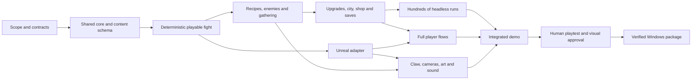

# MVP readiness and implementation order

Review date: 20 September 2026. Planning only. Source baseline: `1e78ddd`, plus the owner's request to identify glaring holes before starting an MVP. This plan orders implementation; it does not replace the mechanic decisions or select a smaller final game. Current progress remains in [STATUS](../STATUS.md).

## Readiness verdict

**There is enough settled design to plan and build the common foundations. The complete MVP boundary is not yet ready to call settled.** The original 111 recipe clarifications are closed. The remaining issues are cross-system contracts, content selection and two pending owner choices, not another backlog of unanswered recipe questions. No game implementation starts as part of this planning assignment.

| Finding | Why it matters | Treatment before dependent work |
| --- | --- | --- |
| First-MVP size has never been selected | A three-fight experiment, one complete city and four full campaigns require different content and acceptance criteria | Owner question pending. Recommend one complete City 1 with Mara. Common rules work is useful for every option. |
| Robot recoil still says prepared Shield is inactive during firing | Installed Shield now protects automatically; the old robot wording can make the same attack resolve differently in different systems | Owner question pending: recommend installed Shield absorbs ordinary recoil before HP, with explicit bypass exceptions preserved. Recoil remains lethal if HP reaches zero. |
| No single executable order for costs, hits, reactions and delayed effects | Recipe rows and proposed robot/upgrade rules can each be clear while their combined result is ambiguous | Write and test an event contract before complex effects. Preserve explicit clocks and special abilities; ask only if ordering changes an unresolved player-facing outcome. |
| Fight-end clearing, shop purchases and save transactions are not joined up | Supplies bought for the next fight could be erased; restart could duplicate purchases, rewards or upgrade charges | Define phase ownership and committed transaction IDs before the shop and Continue flows. See the transition contract below. |
| The full-city offer pool is not selected or executable | There are 606 recipe drafts and 288 upgrade proposals, but free-text effects are not runtime implementations. Detailed Mystery choices/outcomes are still missing | Select a coherent, versioned MVP content list, then implement and test every effect it can offer. Define complete Mystery transactions before enabling those nodes. |
| Whole-city economy and HP attrition have not been simulated | Paper recipe costs and one worked fight do not establish shop affordability, healing supply, repeated generator sales or a beatable boss | Configurable beta values plus complete-city runs and human tests. This is balance work, not a reason to reopen the base rules. |
| No fresh Unreal project or playable proof exists | Concept boards and the old camera study establish a direction, not input quality, runtime performance or graphics approval | Verify the new toolchain, build the shared core, then an actual interactive build. Human visual approval remains a delivery gate. |

The first two choices were asked together during this review; neither answer is assumed. The other rows are concrete work packages. They do not require a new questionnaire before every implementation step.

## Proposed playable boundary

Pending the scope answer, the recommended first MVP is **Mara's complete first city**: profile/New Game, Mayor choice, gathering and Precision, crafting and removable parts, repeated shots and End Turn, gated encounter choices, rewards and recipe exchange, shops, Mystery visits, boss victory, death and same-seed Continue. Use Mara's city identity and route from the existing progression proposal. The existing 12-encounter route is a possible beta fixture within the selected 10–20 range, not a newly approved count.

Content selection must include the 12 starting recipes, additional rewards that support at least two plausible builds, enough Regular/Officer formations to exercise the route, complete Mystery outcomes, a boss, three valid opening Mayor choices and working shop/Officer upgrade offers. The exact recipe/robot/upgrade IDs and counts are the first content deliverable, not an invented approved “30 recipes” limit. Include at least one healing path, one cooling interaction, saved-part play, Heat/Hot Barrel, a delayed Shield grant and a deliberate upgrade exception so the MVP tests the actual game.

The old three-fight/roughly-30-recipe proposal was never selected. If chosen now, use it as the shorter playable boundary and still keep the same foundations. If full campaigns are chosen, expand the enabled content and campaign gates before acceptance; do not silently label one city as that MVP.

The full design remains four mercenaries with their own three cities and progression trees, the complete eligible recipe and upgrade pools, later difficulty tiers, the ultimate challenge and Steam achievements. A smaller first build is an integration milestone, not deletion of those commitments. No calendar or owner-time cap is imposed.

**Playtest question:** do visible enemy intentions and changing supplies make the player change what they craft, save, install and fire, and does a reward change a later decision? A repeated best sequence regardless of enemies/rewards, compulsory tedious cooling/selling loops, or precision play that is only tolerated for its reward would challenge the design. Automated wins cannot answer whether the interaction feels good.

## Sources and rule precedence

Owner decisions override draft defaults. A general default does not remove a named character, recipe or upgrade exception. Older proposals remain history when a later explicit decision resolves that same issue. A completed source audit is not an exhaustive runtime interaction test.

| Area | Implementation input and its limit |
| --- | --- |
| Rules and chronology | [Redesign plan](REDESIGN-PLAN.md), [decisions](../DECISIONS.md) and current [brief](../BRIEF.md). Historical readiness sections are superseded by this review. |
| Recipes | [606-row catalogue](RECIPE-CATALOGUE.md) and [completed audit](RECIPE-RULE-AUDIT.md), reviewed recipe snapshot `f8a7751`. No recipe-row changes in this review; numbers still need beta testing. |
| Part prices | [Part resale](PART-RESALE.md), its [reference data](data/part-resale-bases.json) and [analysis](analysis/part_resale.py). Fixed source identity and original generated value determine the reference; subsequent bonuses/depletion do not reprice a part. |
| Mercenaries | [Abilities](MERCENARY-ABILITIES.md). Preserve Hot Barrel, Charged Barrel, Find the Seam and Bolt. Quench Recovery/Residual Current are unselected alternatives, not automatic additions. |
| Enemies and routes | [Roster](ENEMY-ROSTER.md), [effects](ROBOT-EFFECTS.md), [patterns](ENEMY-PATTERNS.md), [progression](CAMPAIGN-PROGRESSION.md). Draft values and optional effect aliases require one implementation identity; aliases must not stack as two mechanics. |
| Upgrades | [Catalogue](UPGRADE-CATALOGUE.md), [system](UPGRADE-SYSTEM.md) and [Mayors](MAYORS.md). Individual effects/values remain proposals. The 288-item pool requires typed implementation and interaction coverage. |
| Presentation | [Camera flow](COMBAT-CAMERA-FLOW.md) and the supplied style anchor. 16B preparation, rear claw, visible intentions and 16C action remain the direction. Reference art is not a game asset/build. |
| Validation | [Worked encounter](ENCOUNTER-DRONES-AND-SIEGE.md) and [balance plan](BALANCE-RESEARCH.md). The paper route is an arithmetic fixture; the existing Python studies are not a combat simulator. |
| Later progression | [Endgame](ENDGAME-PROGRESSION.md), [achievements](ACHIEVEMENTS.md) and [Steam integration](STEAM-ACHIEVEMENTS.md). Preserve these requirements in the data/event design; their proposed numbers and gates are not silently approved. |

## Shared implementation foundation

Proposed structure: an engine-independent C++ rules library used by both a graphics-free runner and the Unreal game adapter. Confirm the installed compiler/Unreal versions and a working build in package P01 before fixing build-system details. Do not adapt Magnet Sweep's gameplay code or create an independent Python combat implementation.

The core owns state, legal actions, costs, random draws, effects, outcomes and immutable event records. Both clients submit the same actions and receive the same results. The UI, claw animation and AI policy do not calculate a second version of damage or rewards. Preview evaluates a copied state without spending live resources, consuming random draws or recording achievements. Inputs from Precision are recorded as deterministic collection results, so rendering/physics cannot change a replay's combat outcome.

Keep stable IDs for recipes, owned recipe copies, physical parts, upgrades, robots, encounters, offers and reward transactions. Store original source/resale reference separately from mutable part strength, age, remaining Shield and installation history. Version content, rules, saves and RNG streams. A changed content version must not silently reinterpret an old checkpoint.

A policy interface can later support Jev or another decision maker. Legal action generation, exact arithmetic and rule execution remain local code. Remote AI is optional and is not on the MVP's critical path; no TypeSafe integration is designed or implemented by this review.

## Contracts to finish before feature implementation

**One action contract.** Validate all costs, targets and reservations before committing. Failed actions leave gameplay state unchanged. Distinguish recipe Use, part creation, first installation, reinstallation, Load and Fire; they are not interchangeable trigger events. Record actual material/HP/Heat/Charge payments, part origin and once-only allowances. Copying an output is not another recipe Use. A free grant is not a refund. Multiple legal shots remain possible; only End Turn voluntarily passes play to the robots.

**One resolution contract.** Specify the ordered phases for collection, start-of-turn deliveries, Fire payment/character effects, direct hits, status payloads, enemy reactions, death/rescue, enemy intents, remaining-Shield reads/payments, retention, reset and cooldown ticks. Use the existing explicit recipe clocks first. A stable acquisition-order/ID fallback for simultaneous upgrade hooks is a proposal to test, not permission to move a printed trigger. Document the exact four-turn escape display using a trace; departure replaces the normal action. Never silently reroll committed enemy intent when the player crafts or fires.

**One transition/save contract.** Proposed transaction boundary for a continuing fight result: settle earned rewards once; clear that fight's obsolete raw materials/parts and pending fight-only effects; restock once; retain accepted between-fight purchases and scheduled entry grants; construct and persist the next fight's entry snapshot before its first repeatable action. Identify when each reward is offered/accepted and keep partially handled loot screens resumable. A noncombat Mystery counts as a node, not a completed fight that invents an extra shop restock. Explicit upgrade triggers may still refer to that node.

Fight-entry reset must clear recipe cooldowns and fight-local tracking without clearing new supplies bought after the previous fight. The entry snapshot contains all rollbackable campaign state, offer/stock state and deterministic seeds. An unfinished-fight Continue restores it, including in-fight currency changes and consumed upgrade allowances. Profile discoveries already seen remain recorded. Death commits campaign termination; same-seed restart is not a revive. Completed reward IDs and profile unlocks must not repeat after a crash or reload. Reuse this event/receipt foundation for later Steam work rather than designing a second save system.

**One collection/economy fixture.** Keep selected baseline steering, one collection per round and one optional Precision attempt per fight. Set versioned beta values for ordinary yields, Precision bands/commit-cancel behavior, temporary/permanent bonus combination, starting HP/Credits, shop quantities/prices, cores and loot. The proposed 10-material haul, 80 HP and meter cap/decay values remain test inputs. Choose explicit defaults for the enabled content; do not wait for final balance and do not add an action/storage cap to conceal an exploit.

**One enabled-content manifest.** List every possible MVP starter, offer, grant, robot, status, Mystery and upgrade by ID, including nested generated outputs and summoned robots. Map each to supported effect operations and test fixtures. Detect a reference to unsupported content at validation/build time and exclude it from offers until implemented. Preserve full catalogue source data; staging implementation is not a permanent recipe-unlock system. A player should never receive a descriptive but nonfunctional reward.

## Dependency-ordered work packages

These IDs describe build order, not a competing progress tracker. A package may begin only when its listed prerequisites supply the stated contracts. P00 resolves the two owner choices and produces the enabled-content list and contracts above. If an answer remains pending, common contract preparation may proceed but the affected content/acceptance rules remain blocked.

| ID | Package | Depends on | Deliverable and evidence required to finish |
| --- | --- | --- | --- |
| P00 | Scope, contracts and content selection | — | Record scope/recoil answers; write event, transition, gathering and save contracts; name the exact enabled content and provisional balance values. No implementation from assumed answers. |
| P01 | Fresh core and Unreal build setup | P00 | New project/library, headless executable and minimal Unreal host. Record reproducible commands and tool versions; launch both locally. No old game code. |
| P02 | State, IDs and typed content | P01 | Integer state, source identities, effect operations, manifest validator and versioned serialization. Round-trip representative state; reject duplicate IDs, broken references and unsupported effects. |
| P03 | Deterministic actions and events | P02 | Legal-action API, atomic costs, queued triggers, separate RNG streams, dry-run preview, logs and entry snapshots. Same version/seed/actions reproduce the state/event trace; preview is side-effect free. |
| P04 | First complete graphics-free fight | P03 | Start, craft, reserve/install, Load/unload, target, Fire, End Turn, enemy actions, win/death and restart. Reproduce the approved drones/siege arithmetic, including 20 damage → 17 after Armor and 20 Shield absorbing 18. |
| P05 | Part, recipe and character effects | P04 | Implement every operation needed by the selected recipe pool, Hot Barrel, Heat and relevant statuses. Verify the edge-case matrix below, generated-part prices and explicit exceptions. |
| P06 | Robot patterns and formations | P04 | Committed intent, fixed/seeded pattern templates, roster effects, escape, summoning and boss phases needed by the selected city. Verify gates, action eligibility, preview updates and bounded summons. |
| P07 | Collection and material economy | P05 | Deterministic steering/Precision result model, once-per-round/fight rules, timed gathering bonuses and configurable material values. Prove quantities and bonus consumption; no extra haul from another shot. |
| P08 | Permanent upgrades and Mayors | P05, P06, P07 | Typed exceptions, scoped trigger ordering, ownership/stacking, acquisition/removal rules and complete eligible Mayor/Officer/shop offers. Test explicit retention, grant, cost and death-prevention cases in the enabled pool. |
| P09 | City route, loot and Mystery outcomes | P06, P07, P08 | Gated encounter generation, counting, one boss option, rewards, memory exchange, full Mystery transactions and city result. Demonstrate a complete route with meaningful choices and no unavailable offers. |
| P10 | Shop and between-fight transactions | P05, P08, P09 | Buying resources/recipes/upgrades, core/eligible-part sales, finite stock, exactly-once restock and supplies for the next fight. Check affordability, fixed sale references and duplicate/reload handling. |
| P11 | Profile, saves and Continue integration | P03, P09, P10 | Collection, character unlocks, New Game replacement, between-fight resume, checkpoint restart and death. Crash/reload checks at purchase, reward acceptance, city clear and fight entry; no duplicate rewards or lost new supplies. |
| P12 | Complete-city simulation and reports | P10, P11 | Run recorded seeds with several simple policies; output wins, HP/resource curves, purchases, recipe/upgrade choices, turns, stalls and exact failure traces. Hundreds of fast runs only after the core fixtures pass. |
| P13 | Unreal action adapter and debug controls | P04 | Bind visible state and controls to the existing core, including action rejection and logs. Same scripted input sequence produces the headless result; no combat calculations in presentation code. |
| P14 | Player UI and campaign flows | P05, P07, P09, P10, P11, P13 | Profile/mercenary selection, intents, Recipe/Shop, readable part assembly, target/load/fire, End Turn, rewards, tutorial, death and city completion. Show exact costs/remaining Shield and explain disabled actions. |
| P15 | Claw, rig, cameras, sound and readable art | P07, P13 | Actual 16B/16C transitions, rear claw with Precision input, distinctive rig/city/robots, clear hit/Shield feedback and brisk repeat firing. Log asset rights and verify 20+ parts without a logical cap. |
| P16 | Integrated MVP candidate | P08, P12, P14, P15 | Package the selected playable boundary with its entire enabled manifest. Complete a route through the graphical build; cross-check its recorded decisions in the headless core. Finish runtime content coverage and fix integration failures. |
| P17 | Human tests and balance iteration | P16 | Observe comprehension, meaningful choices, repetition, Precision enjoyment and controller/mouse behavior as applicable. Klaus verifies graphics and approves visuals; compare observed strategies with simulation results and tune/retest changed cases. |
| P18 | Verified demo delivery | P17 | Reproducible Windows package, independent launch/play/save checks, resolution/input-focus and performance checks, documented build ID and known limitations. Close the selected MVP acceptance criteria with actual evidence. |

P13 is intentionally available after P04 even though listed later: it can run alongside P05–P12 once the core action interface is stable. P06 can proceed alongside P05; P14 and P15 can proceed in parallel after their prerequisites. If agents are assigned later, use separate core/content, Unreal/UI and art/audio paths; one integration owner maintains STATUS and the contracts. Parallel activity does not waive dependencies.

## High-risk verification matrix

These are behavioral checks for the implementation, not new balance rules or tests of document wording.

| Area | Minimum representative evidence |
| --- | --- |
| Turn and cooldown | Zero-shot End Turn; multiple shots without another haul/tick; cooldown 1 blocks the next round; explicit cooling permits a legal reuse; independent copies; no-cooldown use limits and named exceptions. |
| Parts and Shield | Auto-installed Utility grants; remove/save/reinstall; first-install costs/values counted once; earlier-install history survives removal; drain 6 then 4 by 5 leaves 1 then 4; no refill; next-round delivery versus retention; pre-reset conversion. |
| Damage and characters | Whole-number combined percentages; independent spread hits in placement order; explicit payload targets; lost later hits on dead targets; zero base damage alongside the enabled character's explicit exception (Hot Barrel for Mara; Charged Barrel when Noor is enabled). |
| Costs and death | Full cost + 1 for own HP costs; failed atomic payment; enemy recoil Shield rule after selection; lethal recoil interrupts the shot; simultaneous last-robot/player death; an enabled explicit rescue exception. |
| Enemies and RNG | Previewed intent stays committed; effects update forecasts lawfully; summoned entities cannot act early; escape warning/actions/departure; no loot for fled enemies; same seed/choices repeat after Continue. |
| Economy and persistence | Fixed price after a discount/copy/bonus; selling eligible reserves with a loaded bullet; no sale of loaded parts; saved shops do not refill; fight-end clearing preserves later purchases; no duplicate rewards; Collection discoveries survive rollback/death. |
| Content interactions | Every enabled effect has coverage plus targeted pairings at high-risk boundaries: cooling + extra uses, grant + refund, Shield spend + retention, death + reward, copied part + original-sale reference. Never claim exhaustive combinatorial coverage. |
| Simulation quality | Compare several policies and common seeds, include poor decisions, report distribution and failures rather than only average win rate. Detect infinite/profit loops and emit a trace; a runner timeout is not a gameplay action cap or forced End Turn. |
| Presentation | At least 20 applied parts on each assembly plus larger builds; clear intents and recoil forecast; accurate preview; focus/resolution changes; accessible readable text; quick repeated shots; actual human visual approval. |

## Expansion after the first accepted boundary

Use the same implementation packages to enable Ivo, Ada/Bolt and Noor, each with their own route/city data and character tests, then the remaining cities and catalogue breadth. If the owner chooses the full-campaign MVP, this expansion moves inside P16's acceptance boundary. Test progression gates per mercenary rather than reusing one identical route graph.

Add Lockdown tiers and the final reveal after ordinary full campaigns, balance reporting and persistent per-character progression work. Resolve their still-proposed entry/reveal thresholds before implementation. Implement local achievement predicates against the shared events and stable reward receipts, then the Steam adapter and platform validation when a real app/build context exists. They cannot infer completion from an uncommitted fight attempt. Keep the optional Jev experiment after legal actions, observations, policy baselines and reports are working; automated feedback comes from recorded outcomes, not an assumed model explanation.

## Current next step

Finish P00 using the pending scope and recoil answers. The immediate follow-up deliverable is a concrete enabled-content manifest and the small set of event/transition traces needed for that boundary. Then request/receive the owner's next implementation goal under the existing step-by-step workflow. This planning request does not authorize starting the engine project automatically. No balance, gameplay or graphics approval is claimed by completing this document.
