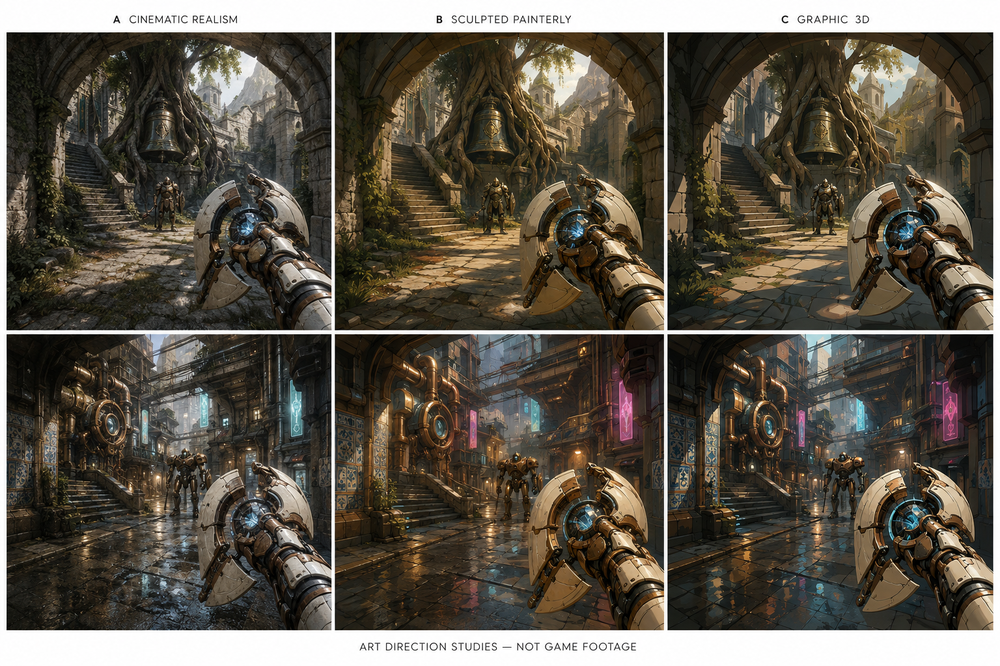

# The cyborg between worlds — art direction

Updated 2026-09-08. **Owner-selected style: B — sculpted painterly 3D.** Klaus endorsed B in the comparison: “B looks great.” Other selected foundations: first person, one modular weapon that also forms a shield, freely chosen attack/defense, and a confined cyborg whose dreams reveal real reachable places. Specific weapon geometry, world designs and palettes below remain proposals; lore, transfer rules and campaign scope remain with design integration. Generated concepts illustrate the direction; actual Unreal quality is still unproven. Production evidence and asset constraints: [art-pipeline.md](art-pipeline.md).

## Visual comparison — 2026-09-08

The comparison shows A: cinematic realism, B: sculpted painterly, and C: graphic 3D. Klaus selected B on 2026-09-08. A and C remain comparison alternatives. These are generated concept images, not Unreal renders, finished models or evidence of achievable runtime fidelity. [Generation prompt and provenance](art-style-comparison-prompt.txt); [asset manifest](assets/manifest.csv).

Klaus asked whether we can realistically create this appearance in the game. B is a plausible direction, but our ability to deliver the pictured polish is unproven. Recommend a small actual Unreal sample before committing to the quality target: a first-person room with finished stone/metal/ceramic materials, a representative weapon section, lighting and movement. Judge close-up quality, visibility during motion and performance. This recommendation does not mean the sample has been built or that the exact concept-image quality is promised.

The board holds scenes and palettes broadly constant to compare treatments; it does not prescribe warm brown palettes for every world or settle the weapon's mechanical design. B and C are relatively close in this study. Any stronger graphic treatment would need a further targeted comparison if preferred.

## Selected direction: one recognizable traveler, radically different places

Make the cyborg and transforming weapon the visual thread through every realm. Their wear accumulates while the architecture, creatures, weather and combat spaces change profoundly. A medieval enchantment should inhabit the same recognizable machine that later accepts cybernetic technology. The player should read their journey directly from the object in their hands.

| Viable overall style | Strength | Main burden |
|---|---|---|
| Cinematic realism | Convincing machinery, scanned environments and dramatic transitions between believable places. | Close-up hands, creatures and magic must match environmental fidelity; inconsistent asset packs become conspicuous. Dense surfaces can bury attack cues. |
| Sculpted, painterly PBR | Substantial modeled forms, tactile metal/stone/fabric, selectively painted surfaces and expressive silhouettes under rich 3D lighting. Works across fantasy and technology. | Needs deliberate material and shape unification; “stylized” cannot become flat colors on primitive meshes. |
| Graphic 3D | Strong value grouping, deliberate edges and illustrated shadow treatment with substantial 3D forms. | Surface and lighting treatment must stay consistent across imported assets; outlines and effects must preserve combat readability. |

**Selected: sculpted painterly 3D, implemented with tactile PBR materials.** Give it beveled forms, surface depth, broad painted color transitions, layered materials and strong animation. Use expressive directional lighting and contact shadows with controlled surface noise; avoid making outlines or an experimental toon shader the foundation. Worlds can have distinct palettes and architecture while sharing this treatment. Keep enemies, attack cues and attachment changes readable during movement. This supports a distinctive world while allowing reusable environment kits and original hero assets.

## Hands and weapon: the object the player learns

Propose ivory ceramic forearm plates over dark articulated joints, exposed copper repairs and a distinctive split-ring core. The grip, core and one recognizable repair scar remain visible across upgrades. Keep humanoid hands for expressive contact and a tractable rig.

The weapon has a compact mechanical spine and articulated outer plates. Attacking aligns them into a delivery channel; guarding fans them into an asymmetric shield around the same core. It must look like one engineered object transforming, with believable hinges and hand support. Exact attack forms follow gameplay.

Keep the shield's strongest edge below and beside the aiming area, preserving sight of approaching enemies. Show impacts at their actual contact positions. Clear silhouettes and a small state indicator communicate readiness; constant full-screen glow would conceal the skill test.

Build a dedicated first-person rig for grip, attack, guard, deflection, impact, traversal and attachment installation. Test rapid switching, interruption, aiming and wall proximity together. Animation must follow player choice rather than silently impose a mode timer. Generic gun animations may provide references but will not finish this mechanism.

## Tech and magic share construction rules

Mechanisms change the weapon's profile: a focusing fork, anchoring foot or reflective facet. Cores change material behavior and emitted energy; catalysts add visible connections between functional parts. Do not rely on rarity color to explain the effect.

Technology favors precise sockets, measured pulses and machined movement. Magic follows engraved channels, suspended fragments and organic rhythms. A frost crystal can lock into a copper collar; a city-made lens can focus an older rune. Preserve contact points and the original silhouette, so hybridization reads as earned adaptation. This visual vocabulary does not decide which powers cross worlds.

## Three realms with different spatial demands

**The Bellroot Kingdom.** Medieval towers lean through enormous roots; cracked bronze bells hang over flooded cloisters. Tight ambush passages open onto stepped courts and exposed bridges. Enemy wind-ups remain visible against broad stone masses; roots and buttresses create flanking routes. Traversal emphasizes elevation and sheltered approaches. Dragons are an eventual aspiration, with substantial creature, animation and encounter costs.

**The Rainstack.** A cyberpunk district climbs around an abandoned transit shaft. Maintenance passages, market shutters and roof platforms create intersecting firing heights. Sliding barriers and readable surveillance beams could change which route is safe. Rain, signage and reflections establish atmosphere without hiding targets. Start with a compact district kit; a functioning metropolis, crowds and traffic are separate ambitions.

**The Tide Archive.** A coastal civilization carved libraries into black cliffs beneath colossal stranded vessels. Low tide exposes causeways; sheltered galleries lead above open basins. Long approaches, interrupted cover and attacks from upper ledges favor deliberate positioning. Authored tide states could change routes between encounters. Avoid promising a fully simulated ocean or unrestricted underwater combat.

Procedural assembly should preserve each realm's spatial grammar: connection heights, cover, sightlines and distinctive landmarks. Randomly scattering different props would not produce these differences.

## First beta: escape into the impossible

Recommend a short confinement interior opening into a playable Bellroot courtyard and connected tower route. The first dream shows a broken bell held inside a root. After escape, the player reaches that exact landmark, touches it and fights around it: recognition becomes physical evidence.

Stage the crossing through a dark service aperture. Sterile sound falls away; warm daylight catches the same battered forearm. Roots intrude through the frame, and the courtyard opens beyond. A controlled threshold can support streaming without requiring a continuously rendered portal into another complete world.

The beta needs original close-up hands/weapon, a coherent confinement kit and courtyard kit, convincing enemy action, one visible attachment transformation and effects that survive combat. Custom rigging, lighting continuity, portal masking, collision and packaged performance are real integration work. Gameplay must include meaningful reward choices; this reveal cannot substitute for them.

**Main visual risk:** disconnected asset packs could make the realms feel like unrelated demos. Keep the protagonist, material response, threat readability and transition motifs consistent; spend bespoke effort on the weapon and memorable landmarks. Verify this in moving Unreal gameplay before multiplying realms.
