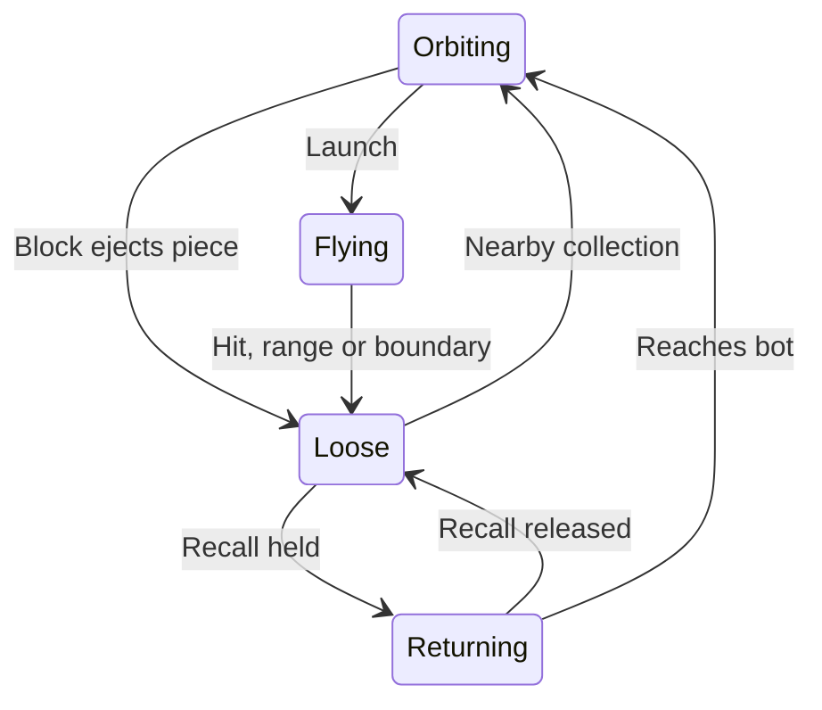

# Scrapstorm — proposed game design, v0.1

**Date:** 2026-09-07, Europe/Oslo. **Stage:** design exploration; no prototype or production selection. **Working title:** Scrapstorm.

Prepared for Klaus's 17-point request. Two game designers exchanged a proposal, challenge and revision directly: one owned combat feel, the other run structure and replay. The coordinating designer integrated their conclusions with the prior market research. Their agreement is design evidence, not player evidence.

**The governing question:** is throwing, dodging and recovering enjoyable before we add upgrades, unlocks or a trend connection? If not, the central interaction changes or the concept is held.

The biggest revisions are a shorter **5–7-minute target run**, four encounters, two upgrade choices, six initial upgrade definitions, conserved ammunition, and unrestricted recall without a movement penalty. The earlier eight-minute target was an estimate, not a reason to stretch play.

All timing, damage, movement and content figures below are **initial design/tuning proposals**. They describe one implementable baseline rather than measured balance or a promised shipping inventory.

## 1. Elevator pitch / hook

**Your armour is your ammunition.**

Scrapstorm is a fast arena roguelite about a tiny magnetic robot that turns six pieces of junk into a shield and a weapon. Throw the shield through a crowd, dodge while exposed, then pull the pieces back—or fire again after recovering only a few.

The intended pleasure is a physical rhythm: **clatter into formation → satisfying burst → a deliberate escape → pieces snap home**. The meaningful question is when to give up protection and how much to recover before attacking again.

## 2. Genre and platforms

- **Genre:** top-down arena action roguelite, with active aiming, bounded encounters and temporary upgrade choices.
- **First platform:** Windows PC, premium offline release on Steam.
- **Input targets:** keyboard/mouse and gamepad. The day-one test can begin with mouse/keyboard; a complete game needs both control paths tested.
- **Session:** approximately 5–7 minutes for a typical complete run, adjustable downward if encounters become repetitive. Quick restart after defeat.
- **Other platforms:** Linux, Steam Deck verification and consoles are later possibilities, not included in the initial work estimate.
- **Engine:** undecided until prototype implementation is authorized. The design needs ordinary 2D movement and collision, not rigid-body piles or a custom physics engine.

## 3. Target audience and comparable titles

Primary players enjoy aiming, positioning and a small number of consequential combat choices. They like short runs that improve with practice and builds that change how they move. Secondary players include arcade score-chasers and people attracted to expressive miniature machinery.

Interest in upcycling supplies possible discovery and visual inspiration. Those people are not presumed to be game buyers.

| Comparable | Useful reference | Our proposed difference and the competitive burden |
|---|---|---|
| [Brotato](https://store.steampowered.com/app/1942280/Brotato/) | Arena pressure, legible enemies, temporary builds and low premium price. The Sep 6 US snapshot recorded **$4.99 regular**, with a promotion separately recorded. | Our finite physical pieces serve as both protection and ammunition. **Active aiming alone is not a distinction:** Brotato already offers manual aiming. Its much larger item/character inventory makes value competition difficult. |
| [SNKRX](https://store.steampowered.com/app/915310/SNKRX/) | A compact control premise combined with build decisions. **$2.99 regular** in the same snapshot. | Scrapstorm uses direct movement and deliberate volleys rather than steering an automatically attacking party. SNKRX's substantial hero/class inventory is well beyond our initial scope. |
| [Spellbound Survivors](https://store.steampowered.com/app/2602450/Spellbound_Survivors/) | A smaller arena-roguelite comparator with upgrades. | The Sep 6 snapshot recorded **38 Steam-purchase reviews** at $4.99 regular. Merely entering this genre with an upgrade system does not establish visibility or sales. |
| [Orbital Arena](https://store.steampowered.com/app/3747530/Orbital_Arena/) | An adjacent arena/shield reference. | The same dated snapshot recorded **zero Steam-purchase reviews**, not zero sales. Orbiting/shield imagery alone is not a commercial hook. |

Store descriptions were rechecked on Sep 7; standardized price/review numbers above retain their Sep 6 capture date and all-language Steam-purchase filter. No competitor hands-on play session was performed for this brief.

## 4. Core gameplay loop

A normal combat exchange should last a few seconds:

1. **Read the threats.** A pack of biters approaches; a shooter starts its visible firing tell. Notice your held pieces and where loose pieces have landed.
2. **Position.** Group the biters into an efficient shot, leave an escape route and choose whether to stay near the expected landing point.
3. **Choose the moment.** Hold the ring briefly to meet an incoming shot with protection, or launch now to remove the approaching threat and dodge the shot while empty.
4. **Throw.** A single press launches every piece currently attached. The action must have a crisp, substantial impact, and it immediately changes your defensive state.
5. **Recover in motion.** Cross close to landed pieces for automatic collection, or pull them toward you while moving to safety.
6. **Choose how much is enough.** Two pieces may be sufficient to finish a weak enemy now. Waiting for six gives a larger volley and more protection, but may lose an opening.
7. **Reassess.** The next throw leaves scrap in new places; the next enemy mix makes a different recovery route useful.

The decisions that might sustain repeated play are **timing, aim, distance, target grouping and partial recovery**. The run's upgrades should alter those decisions rather than conceal a repetitive base action.

The principal risk is explicit: this could still feel like an ordinary gun with a tiresome reload. Removing inconvenience does not prove that the replacement is interesting.

## 5. Key mechanics: prototype rules

### Baseline values and inputs

Use abstract world units for the first implementation. One bot diameter is approximately one unit; the initial arena is a simple 24 by 14 unit rectangle. These values should be easy to change together.

| Mechanic | Input and concrete rule | Feedback | Failure / edge rules |
|---|---|---|---|
| **Move and aim** | WASD moves at an initial 5 units/second, with normalized diagonals. Mouse aims independently. Movement remains available during launch and recall. Gamepad uses left stick to move and right stick to aim. | Immediate movement; a small front-facing magnet and subtle fan preview show aim. | Boundaries stop the bot without damaging it. No dodge roll or invulnerability action. |
| **Carry scrap** | Start a normal run with **six pieces attached**. Six is the fixed initial total across held, flying, loose and returning states. Nearby loose pieces within about 0.8 bot diameters collect automatically. | A visible six-part orbit plus a small held-count display. Each collected piece adds a distinct clink. | Pieces cannot leave the playable area or be permanently destroyed. Enemies do not consume them. Cosmetic debris is visually separate and is not loot. |
| **Launch** | Press LMB / right trigger once to throw **all currently attached pieces**, each dealing **1 damage**. Initial maximum outbound distance is 7 units; speed about 14 units/second. A full ring uses a deterministic fan of about 35 degrees; fewer pieces occupy the central directions, keeping partial volleys useful. | Brief recoil, a strong mechanical clack, short readable trails and enemy hit flashes. | Holding the button does not repeat fire. Empty fire gives a quiet empty cue. Fire is disabled while recall is held and is not queued for later. |
| **Land** | Each piece normally stops attacking and lands after its first enemy hit, range limit or arena boundary. A piece lands inside the boundary, even when it hits the edge. | Flying pieces have bright trails; landed pieces have a clear, quieter outline. | A flying piece cannot instantly reverse into the ring. Its flight and return distance create the exposure period; there is no separate mandatory reload timer in the baseline. |
| **Recall** | Hold RMB / left trigger to attract **all loose pieces anywhere in the arena**. Initial return speed is about 10 units/second. Release stops their attraction and settles unfinished returns where they are. Movement stays at full speed. | Curved magnetic traces, an electrical hum and rising clinks as pieces attach. Loose positions remain visible. | Returning pieces give no protection until attached. Baseline return is harmless to enemies. Toggling recall cannot duplicate pieces or reset an upgrade's damage eligibility. |
| **Shield / block** | Any ordinary hit on a bot with held scrap ejects **one piece** instead of damaging hull. Protection is deterministic; decorative gaps in the orbit never decide whether a hit blocks. Contacting biters are pushed back slightly. | Clear impact at the threatened side, one piece kicked outward, a block sound distinct from hull damage. | No damage is dealt merely by orbiting or blocking. A spent piece is knocked roughly two bot diameters away and becomes recoverable after its short outward travel. A brief initial 0.25-second guard grace prevents one overlapping collision from consuming several pieces instantly. |
| **Hull** | Start with **three hull pips**. A hit with no attached scrap removes one. Hull damage gives about one second of clearly indicated damage grace. Hull persists through the run, with no baseline healing. | A harsher sound, a clear hull pip loss and a short outline pulse. Shake can be disabled. | Zero hull ends the run. Damage grace prevents an ambiguous instant three-hit death. |
| **Encounter clear** | Defeat a finite assigned set of enemies. Clear as soon as they are all defeated; later packs may arrive early when the previous pack is cleared. | A short relief cue, automatic recall of all six pieces and a safe transition. | Clear stops hostile projectiles and combat. There is no empty-arena cleanup task and no obligation to wait for a survival timer. |

Damage is expressed as 1 per piece and 2 base enemy health rather than the earlier 4/8 draft; this is the same two-hit relationship using simpler units.

Each piece follows this lifecycle:

### The two ordinary enemies

**Biter:** a clamp-shaped machine, initially 2 health. It approaches the player at roughly half the player's speed. Its purpose is to create grouping, spacing and escape decisions. Contact causes an ordinary block/hull hit. It needs a recognizable approach and hit reaction rather than an unpredictable lunge system.

**Spitter:** a socket-shaped machine, initially 2 health. It approaches a useful distance, stops and visibly charges a shot. Start with a 0.7-second tell, aim locking during the last part of that tell, and a slow straight projectile. Stagger shooters' schedules so simultaneous attacks are readable. A nonlethal hit does not secretly cancel an already committed shot.

Both must be avoidable through movement when the player is empty. Difficulty should come from combinations and position, not attacks that require an unexplained shield exception.

**Prototype edge checks:** all six pieces remain recoverable after blocks and boundary hits; releasing recall preserves their state; zero ammo never requires a kill to recover ammo; partial volleys stay centred; only one block occurs per guard-grace window; pause/focus loss freezes combat and releases held inputs; defeat cannot continue simulating behind a menu.

## 6. Key features and selling points

1. **The same visible objects protect and attack.** A throw changes both your offensive and defensive options immediately.
2. **Partial recovery gives control over commitment.** Fire with two pieces or wait for six, using the same controls.
3. **Recovery happens in the battlefield.** Where scrap lands and where the player moves affect how long they are exposed.
4. **Small builds should change behaviour.** Narrow piercing shots, broad crowd-clearing fans and damaging return paths suggest different movement.
5. **A toy-scale material identity.** Familiar junk becomes useful, with an appealing collect-and-release sound and motion.

These are specific differentiators against the inspected comparator pitches, not claims of unprecedented mechanics. Their value depends on what a player notices and enjoys in an actual ten-second sequence.

## 7. Game structure and scope

The proposed first product has:

- **One playable robot**, one arena/environment and one consistent control scheme.
- **Four encounters per run:** Opening, Crossfire, Pressure and Foreman.
- **Two ordinary enemy types** and one finale unit assembled from learned behaviours.
- **Six upgrade definitions**, of which the player selects two per run.
- **Six small spawn-pattern templates**, reusing trains of biters, split entries, shooting lanes and mixed packs. Entry directions and upgrade offers vary between runs.
- **One standard mode**, plus a harder preset unlocked by the first clear if the same-content variant survives testing.
- A short first-run introduction, local records, settings, pause and immediate retry.

There is no multi-level campaign. One successful run resolves the premise. **5–7 minutes is a pacing target**, not a measured campaign length or guaranteed replay value. Do not lengthen health bars or stagger trivial enemies just to hit that number.

An active run can be paused. The minimum save covers settings, completions and records; suspend-and-resume mid-run is an optional extension rather than a hidden commitment.

## 8. Progression systems

### During a run

After encounters **one and two**, combat pauses and the player chooses **one of two distinct upgrades**. Each is nonstacking. The offer generator avoids upgrades already shown that run and excludes incompatible choices. There is no currency, shop or reroll step.

All six definitions are eligible from the start. A player should not have to grind to reach the enjoyable interactions.

| Upgrade | Concrete starting rule | What should change in play |
|---|---|---|
| **Lance Rails** | About a **12-degree fan**. An outbound piece can hit one extra enemy, never the same enemy twice in that flight. Mutually exclusive with Scatter Fork. | Line enemies up and aim through them; accept narrower coverage. |
| **Scatter Fork** | About a **55-degree fan**, with stronger hit knockback and unchanged damage. | Make space across a wider approach; get closer or aim carefully to land two hits on a single target. |
| **Return Teeth** | A launched piece can deal **1 return damage to the first enemy it crosses** during that shot cycle. Return speed is about 25% slower. Blocking alone does not arm this damage. Releasing/repressing recall never refreshes it. | Move sideways so returning scrap passes through pursuers, accepting a longer exposed period. |
| **Close Coil** | Pieces within roughly **four bot diameters** return at twice the normal speed; distant pieces use normal speed. | Stay nearer a landing area for rapid recovery, or retreat and wait longer. |
| **Grounding Guard** | A block pushes nearby biters away without damaging them; its spent piece travels about twice as far before landing. | Gain breathing room at the cost of a longer recovery. |
| **Launch Treads** | A throw grants roughly **20% additional movement speed for 0.6 seconds**. The boost does not stack or refresh while active and grants no invulnerability. | Deliberately use the exposed moment to cross a gap or reach a better angle. |

Close Coil and Return Teeth may combine; use their multipliers consistently. Lance and Scatter cannot combine because their conflicting fan directions would dilute both choices.

**The strongest unresolved design choice:** Return Teeth may be enjoyable enough to belong in the base mechanic. Test a toggle early. If harmless recall feels like work and damaging return produces deliberate manoeuvres and retries, promote it into the core and replace that upgrade. Do not deliberately place the enjoyable interaction behind an unlock.

### Across runs

Save the first completion, best clear time, best finishing hull and completion of the harder preset. Run upgrades reset on every attempt; no permanent damage or health advantage carries over.

The harder preset should use more simultaneous pressure and tighter—but still legible—shot scheduling. It should not multiply enemy health to lengthen sessions. Returning for a cleaner run or a different two-upgrade build is an intended motivation, not established retention.

## 9. Narrative and setting

**Pip** is a homemade magnetic salvage robot. A broken sorting line has started treating useful objects—and Pip—as waste. The player uses six cherished bits of junk to get through the line and shut down its supervisor, the **Foreman**.

The setting is a small sorting tray on an oversized workbench. Washers, clamps, enamel paint and worn labels make the scale recognizable. The tone is playful, slightly frantic and sympathetic to the little machine.

The story fits into a few visual beats: Pip powers on, the line labels it for disposal, it fights through the machinery, and the defeated Foreman goes quiet while Pip's work lamp comes back on. Personality comes from tilts, eye/light changes and beeps. There is no voiced cast, dialogue tree or branching story.

## 10. Art and audio direction

### Visual direction

Top-down **2D with a physical toy-set appearance**: chunky silhouettes, gentle contact shadows, restrained material texture and readable animation. Original paperclips, washers and bottle caps are cosmetic shapes with uniform baseline physics.

Pip is a bright rounded shape against a quiet warm-grey tray. Biters use angular jaw silhouettes; Spitters are squat with an obvious barrel. Friendly scrap, incoming projectiles and landed pieces differ through **shape, motion and brightness as well as colour**. Effects must not obscure the small bot or its remaining protection.

References express a direction, not an asset-production claim:

- [GNOG](https://store.steampowered.com/app/290510/GNOG/): the playful toy-object identity and expressive interaction feedback.
- [Wilmot's Warehouse / Richard Hogg](https://store.steampowered.com/app/839870/Wilmots_Warehouse/): a reference for strong graphic shapes and recognizability at a glance.
- [WALL-E](https://www.pixar.com/wall-e): wordless sympathy for a useful little robot and the charm of familiar discarded objects. Pip and the world need their own design.

### Audio direction

The signature is **six objects snapping into a tuned magnetic chord**, followed by a satisfying airy mechanical clack when launched. Use varied dry metal/wood/plastic hits without making the mix harsh. Recall has an electrical rise; hull damage sounds unmistakably different from a successful block.

A compact rhythmic electronic track should support motion and leave room for enemy cues. [SNKRX's credited Kubbi soundtrack](https://store.steampowered.com/app/915310/SNKRX/) and [GNOG's reactive Marskye soundtrack](https://store.steampowered.com/app/290510/GNOG/) are musical/interaction references; this is an intended direction, not a listening evaluation performed in this session.

Initial audio scope: one combat loop with a modest pressure layer, short win/lose cues and approximately a dozen event families with small pitch/variation changes. Danger tells take mix priority over repeated hits and music. Keep separate music/effects levels, reduced-flash and shake controls. Asset creation and rights records belong to a later authorized build.

## 11. Sample content: one encounter

**Crossfire**, the second encounter, uses the first selected upgrade.

Pip enters with all six pieces restored and whatever hull remains. A pair of biters comes from the left while a Spitter's charging line appears at the upper edge. Moving toward the lower-right groups the biters while leaving a path away from the Spitter's locked aim.

The player can hold protection until the shot passes, then launch into the grouped biters. Alternatively, an early throw removes the close pressure, but the player has to dodge the shot while empty.

With **Return Teeth**, the player then moves across the side of the pack and recalls. The return path runs through a survivor. Two pieces reach Pip first; the player releases recall and fires them to finish the Spitter instead of waiting for a full ring.

Another mixed pack enters from a different pair of edges, with visible warnings. When its last enemy falls, the encounter ends immediately. The remaining pieces snap home and the second upgrade offer appears.

The content is successful only if the player sees these as useful choices rather than one mandatory sequence.

## 12. UI/UX concept

The arena should carry most of the information. Pip's orbit shows held protection/ammunition; enemy shapes and wind-ups explain threats; bright outlined scrap shows recovery opportunities.

The minimal HUD contains:

- Top left: **three hull pips**.
- Near Pip or its reticle: **held scrap count**, with six small state marks.
- Top centre: **encounter 1/4** and a clear-combat progress indicator based on remaining assigned enemies, not a survival countdown.
- Bottom corner: the **two chosen upgrade icons**, inspectable while paused.
- Results: clear/defeat, elapsed active time, finishing hull, chosen build, Retry and Quit.

Upgrade offers freeze the game and show a short rule, a small trajectory illustration and its consequence. For example: “Shots form a narrow line and pierce one enemy. Less sideways coverage.” Avoid hidden percentage-heavy tooltips.

Keyboard/mouse: WASD, aim cursor, LMB throw, RMB hold recall, Escape pause. Gamepad: left stick move, right stick aim, right trigger throw, left trigger recall, Menu pause. Preserve the last nonzero aim direction when the right stick is released.

Show prompts in the first safe interaction, then during the first empty shot and first recall. Do not stop every few seconds for tutorial text. Pause on focus loss, clear held actions on resume, support remapping and fully operable menus. These are design requirements, not tested features.

## 13. Win/lose conditions and endgame

**Encounter win:** all assigned ordinary enemies defeated.

**Run win:** Foreman defeated while Pip has hull remaining. Its escorts power down, hostile projectiles stop and the results screen follows a short payoff. The boss follows the normal shield/damage rules.

**Run loss:** hull reaches zero. The bot falls apart briefly; Retry starts a fresh full-health/full-scrap run without a long reload or punitive metagame.

**Whole-game completion:** one Standard clear resolves the small story. The harder preset and improved local records supply optional mastery goals. There is no endless content promise.

The first finale can reuse the Spitter's aimed firing tell and release small, bounded Biter groups. Start with a modest boss health pool, e.g. **24 ordinary damage units**, and tune for an exciting short finish. Alive escorts are capped rather than accumulated indefinitely. Do not introduce shield-piercing surprises, long invulnerable phases or inflate health to protect the nominal run length.

## 14. Monetization / business model

**Premium, paid once, initial price hypothesis USD 4.99.**

That should buy a complete compact game: clean controls, coherent presentation, finished Standard run, readable progression, records and reliable packaging. No ads, microtransactions, paid power or live-service obligation.

USD 9.99 is the owner's maximum, not the recommendation for the current single-arena design. USD 6.99 or 9.99 would require stronger evidence of replay value, a more substantial experience or both. Pricing cannot make a thin or boring game worthwhile.

A short playable demo could communicate the shared shield/ammo mechanic once it feels good. Additional arenas, enemies or a small expansion are possible after actual demand; DLC is not required to make the base game complete. No release, expenditure or content schedule is authorized by this brief.

## 15. Market positioning and rough audience size

Proposed store promise: **“Throw your protection away. Get it back before the next hit.”** The first clip should communicate that sequence without a paragraph of explanation.

The commercial hypothesis has three parts:

1. A recognizable action-roguelite audience already buys low-priced games.
2. The finite shield/ammo and recovery loop offers a specific tactile choice worth learning.
3. The toy-junk identity makes the game recognizable and supplies an authentic connection to the miniature/upcycling inspiration.

Only the first has meaningful external evidence. Parts two and three still need gameplay and audience response.

**Rough audience scale:** the broader genre has demonstrated a **million-copy purchase scale**. An Apr 26, 2023 [Blobfish/Seaven press release reproduced by Nintendo-Town](https://www.nintendo-town.fr/2023/04/26/space-gladiators-arrive-sur-nintendo-switch-le-4-mai/) reported over **1.5 million Brotato copies sold**. This is a reported sales milestone, not 1.5 million unique prospects for Scrapstorm, and it is not a current Steam-only audience count.

Our reachable niche—the intersection of active-action players, this control idea, this art and our discovery—is **not numerically established**. The commercially useful initial scale for this studio could be a few hundred buyers, as described in the charter; that is a planning objective, not an audience estimate or sales forecast. There is no defensible basis yet for promising thousands of our sales.

The strongest counterevidence is value competition: Brotato and SNKRX sell much larger build inventories cheaply, while smaller adjacent games can receive little response. Two upgrades and randomized entry directions do not automatically create hours of replay.

The trend is optional discovery help. The [Sep 6 research run](../2026-09-06-next-game/README.md) records Pinterest's historical miniature-from-trash search growth and its limitations. No search conversion or September peak was measured. A game creator should be able to understand and enjoy the combat even with the trend context removed.

The next commercial evidence should come from a readable playable slice: voluntary replay first, then reactions to the actual proposed package and price. Neither a designer vote nor review-count multiplication supplies that evidence.

## 16. Scope flexibility and feasibility

| Keep at the centre | Cut first if time or clarity suffers | Add only after a successful core |
|---|---|---|
| Same pieces are protection and ammunition; deliberate throw and readable recovery. | Extra cosmetic scrap shapes, background detail and secondary animation. | Another enemy creating a genuinely new timing or positioning problem. |
| Responsive independent movement/aim; deterministic blocking; no stranded ammo. | The harder preset and extra completion cosmetics. | A second arena with meaningful geometry, not only a different background. |
| At least two complementary threats to test decisions. | Reduce six upgrades to four good ones. | More build-changing upgrades, one at a time. |
| Clear win, death, instant retry, pause and input reliability. | Reduce four encounters to three if the last ordinary one repeats solved play. | Optional suspend save or additional platforms after their actual cost is understood. |
| Distinct attack, block, damage and collection feedback. | Decorative story beats and elaborate store-media animation. | A broader paid edition only after a new scope estimate and product evidence. |

Two concrete reserve upgrades, **outside the six-item initial pool**:

- **Heavy Clips:** outbound damage becomes 2 instead of 1, while flight and return speed are reduced. The damage increase crosses the Biter's two-health threshold. Its exact speed penalty needs balance work.
- **Bank Rims:** one deterministic arena-edge bounce per launched piece, with a fixed total travel limit. This allows indirect angles but can leave pieces farther away.

The previous **6–7 focused implementation-day / 4–6 owner-hour envelope remains conditional**. A possible allocation is one day for the falsifiable combat test, one for enemies/encounters, one for upgrade interactions, one for presentation/audio, and two to three for integration, controls, packaging, fixes and store materials. This is a stretch estimate, not demonstrated capacity. Recruiting external testers, platform lead time, support and unmeasured compute costs remain separate.

Prototype quality is not the same as premium-game completeness. If the core fails, spending the remaining days on content is not justified. If it succeeds but a satisfying package requires more work, return a concrete revised scope/price decision rather than silently exceeding the budget.

## 17. A complete roguelite round: start to finish

This is an **illustrative six-minute session**, written to convey the intended experience. Timings, enemy counts and fun are not observations from a build.

**0:00 — a small machine, six useful objects.**  
You choose Start. Pip wakes in the sorting tray; six washers, clips and caps snap into a tidy orbit. Three hull lights are full. A warning lamp points to the left edge. The controls are visible but the action begins immediately.

**0:10 — Opening.**  
Two biters close in. You step sideways until they overlap in your aim fan, then click. The ring bursts outward with a clack and both enemies break into harmless little parts. Pip is suddenly a small unprotected shape.

You move toward the landing point. Two pieces snap back before the others. Another biter is nearly lined up, so you fire those two immediately. You have chosen a quick small volley instead of waiting for the full ring.

A Spitter appears with a visible charging tell. This time you wait long enough for protection to return, dodge its locked shot, then launch. The last enemy drops; the encounter ends as soon as it is clear.

**0:50 — first choice.**  
The game pauses. You are offered **Return Teeth** or **Close Coil**. You choose Return Teeth: slower recovery, but your returning pieces can now cut through an enemy. The card's little diagram makes that trade clear. Your hull is still full.

**1:10 — Crossfire.**  
A Spitter holds the upper edge while biters approach from the right. You fire into the close pack and move downward while empty. Rather than returning along the same line, you curve left. Holding recall now pulls the pieces diagonally through a pursuer.

A hit flashes on the return path. The retrieval has become another attack, and your movement caused it.

You make a mistake on the next pack: an early shot spreads too widely and leaves a Spitter alive. You turn the wrong way while empty and lose one hull light. The clear damage cue explains it; brief damage grace gives you time to recover. The next volley finishes the pack. Hull remains at two—there is no hidden heal at the break.

**2:10 — second and final choice.**  
You are offered **Lance Rails** or **Launch Treads**. You pick Lance Rails. The narrower piercing fan seems useful for lining up enemies before drawing the pieces back through them. Your build is now complete, and the next encounters let you use it.

**2:30 — Pressure.**  
More biters enter from separated edges, with warnings. You back toward a corner briefly, then move across the tray instead of continuing around its perimeter. That brings the approaching enemies into a line.

You wait through a Spitter's firing tell with a few pieces still attached. Once its shot passes, you release the narrow volley through the line. The pieces land beyond the pack. Moving to its side gives them a useful return path.

Only two pieces are home when another enemy comes close. You could fire now, but choose to keep recalling this time because the second Spitter is about to attack. A held piece blocks the shot and is knocked back onto the floor. You then release recall and fire the pieces you kept. The decision differed from the quick partial shot in the opening.

The last pack clears. The game gathers the scrap for you instead of asking you to clean the empty tray.

**3:50 — Foreman.**  
The supervisor powers on at the far edge. Its firing tell is familiar, but small groups of biters threaten from the sides. The boss obeys the same protection and damage rules as the rest of the game.

You resist firing just because the ring is full. First you guide the close biters into the line between you and the Foreman. Your piercing volley hits the pack and continues into the boss. You move sideways to turn the return into a second useful path.

One attempt misses. The pieces are scattered farther away and the boss begins charging. You could stay nearer for a quicker recovery, but choose the open side of the tray and dodge while empty. The longer return is visible and understandable; you are not stuck hunting for ammunition.

With the boss almost finished, two pieces return ahead of the others. This is enough. You stop recall and throw the small volley into the opening instead of waiting for six.

**5:40 — payoff and another choice.**  
The Foreman shuts down. Its escorts stop, the warning lamps dim and Pip's little work light comes back on. You finish with two hull pips.

The results show your clear time, hull and **Return Teeth + Lance Rails** build. Retry is immediately available. You may want a cleaner run, or you may remember passing up Launch Treads and wonder how a wider, faster escape-oriented build would feel.

That final desire is the test. If the player feels finished and does not want another attempt, the design has not demonstrated replay value merely because another combination exists.

## Design discussion: decisions and unresolved questions

The two designers' exchange changed the actual specification:

- **Global recall at full movement speed** replaced a limited radius and movement penalty. Distance still matters, while retrieval is less likely to become housekeeping.
- **Partial retrieval** supplies smaller shots without adding another attack button or retaining guaranteed protection.
- **Four encounters and two early choices** replaced the larger round outline. The completed build gets time to matter.
- **Six meaningful upgrades** replaced a quota of eight. Heavy Clips and Bank Rims remain reserve ideas.
- **Spring Guard was rejected:** damage on block could reward never throwing. **Reserve Clip was rejected:** guaranteed held protection after firing dilutes the main commitment.
- **Return Teeth remains a pivotal experiment:** if damaging returns provide the actual enjoyable action, that behaviour may belong in the core.

No discussion established that the base loop or the finished content volume is sufficient. Both designers retained that objection.

## The next playable test

The next authorized implementation should be a **one-day, three-minute combat experiment** with one arena, the two enemies, launch/block/recall, death and instant restart. Begin with simple shapes and clear event sounds. No progression, campaign or content expansion.

First check basic handling against a Biter, then introduce the Spitter to test the shared shield/ammo choice. Observe three to five available target players without coaching each decision:

- Can they tell why a hit blocked or damaged hull?
- Does the shooter change when they throw?
- Do they deliberately stop recall for a partial volley?
- Is retrieval an enjoyable manoeuvre or work?
- Do they choose another attempt and identify a moment they want to repeat or improve?

Directional continuation criterion: with five available players, seek four who understand protection/ammunition, three who deliberately vary a throw or recovery decision, and three who voluntarily retry. Those numbers guide a small design test, not a sales forecast.

Try the Return Teeth toggle before adding a broader upgrade pool. Compare whether it changes movement, described enjoyable moments and voluntary retry. If it alone supplies the enjoyment, revise the core accordingly. If both versions remain rote or frustrating after a focused tuning pass, hold or redesign Scrapstorm. More cards, louder effects and a longer run are not remedies for an uninteresting decision.

**Current evidence:** a design brief, dated competitor sources and a two-designer critique. No playable build, human fun test, demonstrated production duration or purchase-intent result exists.

## Source provenance

- Game rules, fiction, content budgets and sample session: original studio proposals, 2026-09-07.
- [Prior research and source limits](../2026-09-06-next-game/README.md); [US genre snapshot](../2026-09-06-next-game/steam-wide-comparators.json); [arena counterexamples](../2026-09-06-next-game/steam-arena-counterexamples.json); [shield comparator snapshot](../2026-09-06-next-game/steam-challenge-comparators.json).
- Store pages and visual/audio reference descriptions linked above were accessed 2026-09-07. Their descriptions are reported product claims; the style connections are the studio's interpretation. No reference asset was downloaded or reused.
- The Brotato sales figure is an explicitly attributed developer/partner press-release claim reproduced by Nintendo-Town, dated 2023-04-26. No review counts were converted into sales or revenue.

